# Must Be Viral V2 - System Architecture

> Comprehensive architectural documentation for the AI-powered influencer marketing platform

## 🏗️ Architecture Overview

Must Be Viral V2 is built with a modern, scalable architecture combining edge computing, microservices, and AI-powered features. The system supports multiple deployment models from local development to global edge distribution.

### 🎯 Design Principles

- **Edge-First**: Leverage 280+ global edge locations for minimal latency
- **AI-Native**: Built-in AI capabilities with tier-based access controls
- **Security-First**: Comprehensive security layers from authentication to data protection
- **Developer-Friendly**: Extensive testing, documentation, and development tools
- **Scalable**: Auto-scaling architecture handling 10M+ requests/day
- **Resilient**: Multi-layer failover and disaster recovery capabilities

## 🏛️ High-Level Architecture

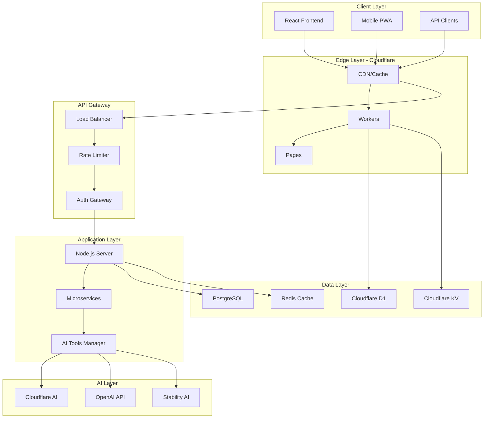

## 🔧 Component Architecture

### 1. Frontend Architecture

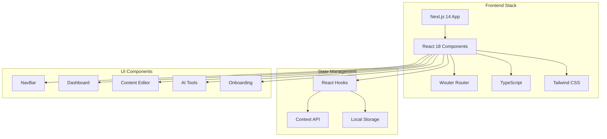

**Key Components:**
- **App Router**: Next.js 14 app directory structure with server components
- **Component Library**: Reusable UI components with TypeScript interfaces
- **State Management**: React hooks and context for global state
- **Routing**: Wouter for lightweight client-side routing
- **Styling**: Tailwind CSS with custom design system

### 2. Backend Architecture

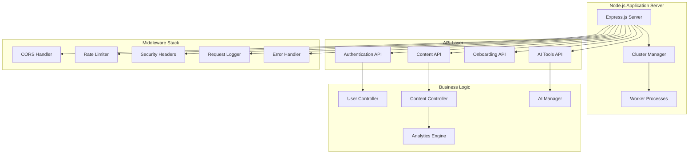

**Key Features:**
- **Cluster Management**: Dynamic worker scaling based on system load
- **Advanced Rate Limiting**: Sliding window algorithm with memory bounds
- **Multi-layer Caching**: L1 (NodeCache) + L2 (Redis) for optimal performance
- **Security Middleware**: Comprehensive security headers and validation
- **Error Handling**: Structured error responses with request tracking

### 3. Database Architecture

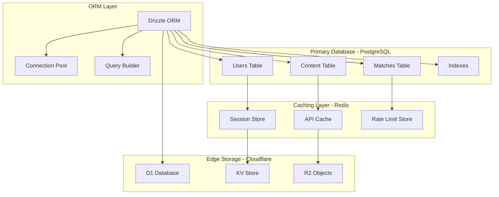

**Database Schema:**
```sql
-- Users: Core user information and preferences
users (
  id UUID PRIMARY KEY,
  email VARCHAR(255) UNIQUE NOT NULL,
  username VARCHAR(50) UNIQUE NOT NULL,
  password_hash VARCHAR(255) NOT NULL,
  role VARCHAR(20) DEFAULT 'creator',
  profile_data JSONB DEFAULT '{}',
  ai_preference_level INTEGER DEFAULT 50,
  onboarding_completed INTEGER DEFAULT 0,
  created_at TIMESTAMP DEFAULT NOW(),
  updated_at TIMESTAMP DEFAULT NOW()
);

-- Content: All user-generated and AI-generated content
content (
  id UUID PRIMARY KEY,
  user_id UUID REFERENCES users(id) ON DELETE CASCADE,
  title VARCHAR(500) NOT NULL,
  body TEXT NOT NULL,
  image_url VARCHAR(1000),
  status VARCHAR(20) DEFAULT 'draft',
  type VARCHAR(50) DEFAULT 'news_article',
  generated_by_ai INTEGER DEFAULT 0,
  ai_model_used VARCHAR(100),
  ethics_check_status VARCHAR(20) DEFAULT 'pending',
  metadata JSONB DEFAULT '{}',
  created_at TIMESTAMP DEFAULT NOW(),
  updated_at TIMESTAMP DEFAULT NOW(),
  published_at TIMESTAMP
);

-- Matches: Influencer-content matching results
matches (
  id UUID PRIMARY KEY,
  content_id UUID REFERENCES content(id) ON DELETE CASCADE,
  influencer_user_id UUID REFERENCES users(id) ON DELETE CASCADE,
  match_score REAL DEFAULT 0.0,
  status VARCHAR(20) DEFAULT 'pending',
  match_details JSONB DEFAULT '{}',
  created_at TIMESTAMP DEFAULT NOW(),
  updated_at TIMESTAMP DEFAULT NOW()
);
```

## 🤖 AI Architecture

### AI Tools Management System

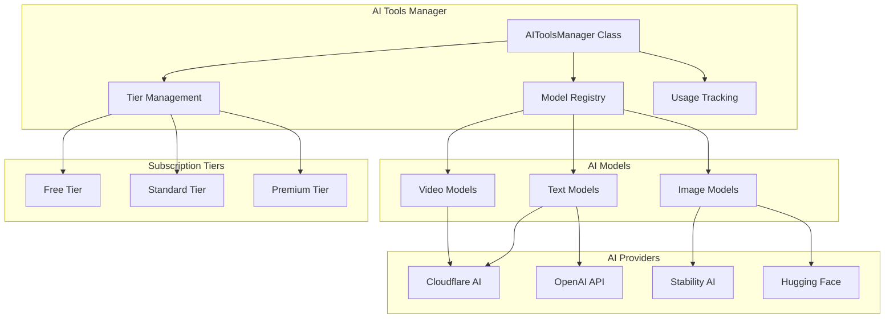

**AI Tier System:**

| Tier | Price/Month | Daily Limits | Available Models |
|------|-------------|--------------|------------------|
| **Free** | $0 | 10K tokens, 5 images | Llama 3 8B |
| **Standard** | $19 | 100K tokens, 50 images, 60s video | + Mistral 7B, Stable Diffusion XL |
| **Premium** | $49 | 500K tokens, 200 images, 300s video | + GPT-4o Mini, Stable Diffusion 3 |

## 🔒 Security Architecture

### Multi-Layer Security Model

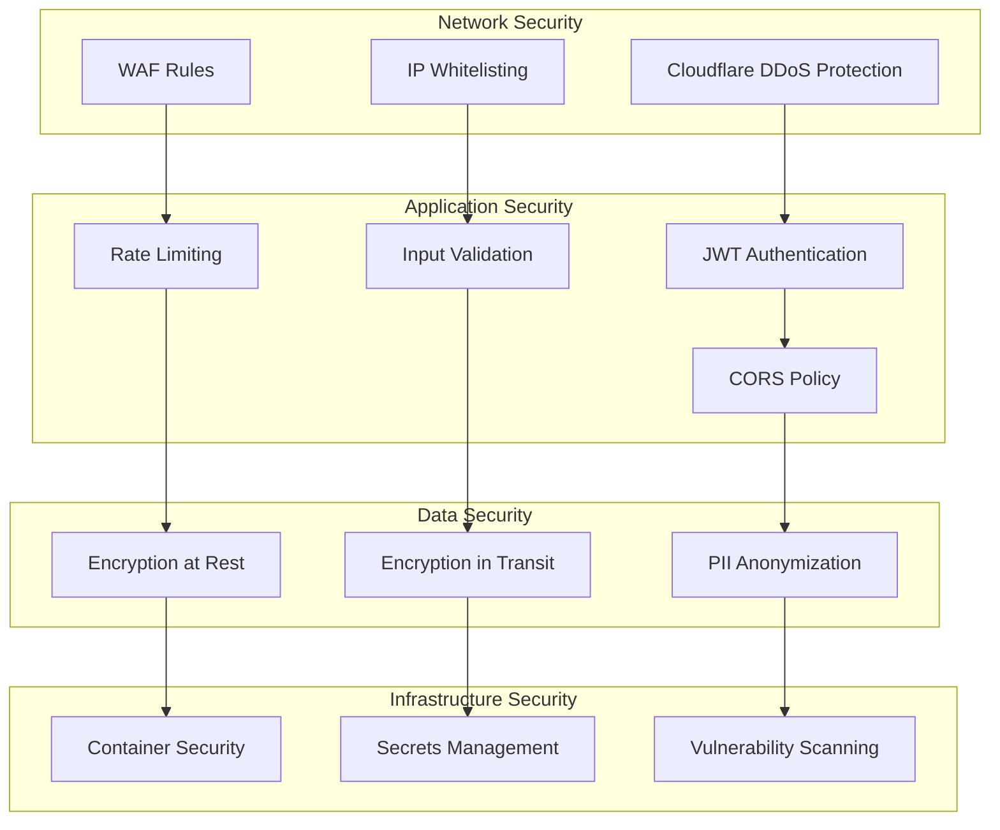

**Security Implementation:**
- **Authentication**: JWT tokens with 24h expiration, secure refresh mechanism
- **Password Hashing**: bcrypt with 12 rounds for secure password storage
- **Rate Limiting**: Sliding window algorithm with IP-based and user-based limits
- **Input Validation**: Comprehensive sanitization and validation for all inputs
- **Security Headers**: CSP, HSTS, X-Frame-Options, X-Content-Type-Options
- **Container Security**: Non-root users, read-only filesystems, minimal attack surface

## 📊 Data Flow Architecture

### Request Processing Flow

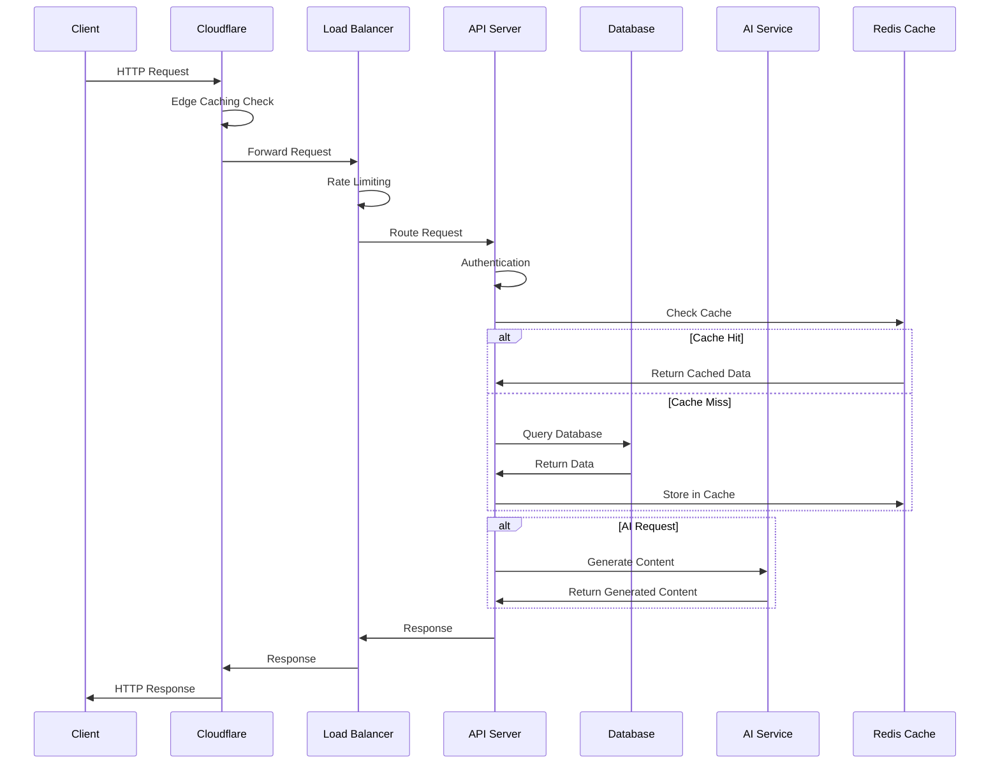

### Content Creation Flow

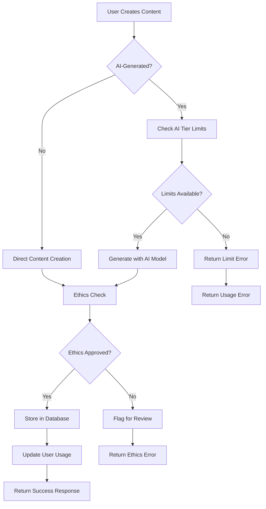

## 🔄 Deployment Architecture

### Multi-Environment Strategy

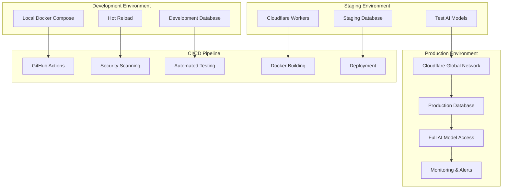

### Deployment Methods

| Method | Environment | Command | Features |
|--------|-------------|---------|----------|
| **Local Docker** | Development | `npm run docker:compose` | Full stack, debugging |
| **Cloudflare Workers** | Staging/Production | `npm run deploy:staging` | Edge computing |
| **Microservices** | Enterprise | `docker-compose -f microservices.yml up` | Service isolation |
| **Performance** | High-load | `docker-compose -f performance.yml up` | Optimized configs |

## 📈 Monitoring Architecture

### Observability Stack

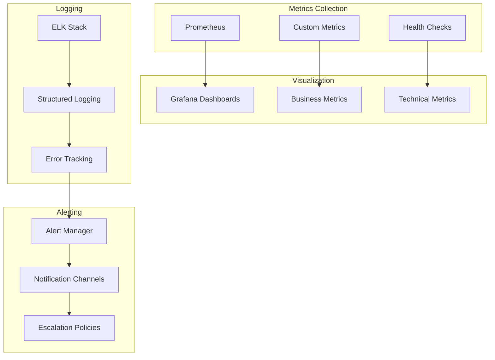

**Key Metrics Tracked:**
- **Performance**: Response times, throughput, error rates
- **Resources**: CPU, memory, disk usage per worker
- **Business**: User registrations, content creation, AI usage
- **Security**: Failed authentication attempts, rate limit triggers

## 🚀 Scalability Considerations

### Horizontal Scaling Strategy

```mermaid
graph TB
    subgraph "Application Scaling"
        A[Load Balancer]
        B[Multiple App Instances]
        C[Auto-scaling Groups]
    end
    
    subgraph "Database Scaling"
        D[Read Replicas]
        E[Connection Pooling]
        F[Query Optimization]
    end
    
    subgraph "Cache Scaling"
        G[Redis Cluster]
        H[Multi-layer Caching]
        I[CDN Edge Caching]
    end
    
    subgraph "AI Scaling"
        J[Model Load Balancing]
        K[Usage-based Throttling]
        L[Cost Optimization]
    end
    
    A --> B
    B --> C
    D --> E
    E --> F
    G --> H
    H --> I
    J --> K
    K --> L
```

**Scaling Capabilities:**
- **Traffic**: Handles 10M+ requests/day with auto-scaling
- **Workers**: Dynamic worker scaling based on CPU/memory usage
- **Database**: Connection pooling with read replica support
- **Caching**: Multi-layer caching with edge distribution
- **AI**: Usage-based throttling with cost optimization

## 🔧 Configuration Management

### Environment Configuration Matrix

| Setting | Development | Staging | Production |
|---------|-------------|---------|------------|
| **Node Env** | development | staging | production |
| **Workers** | 2-4 | 4-8 | 8-16 |
| **Cache TTL** | 60s | 300s | 3600s |
| **Rate Limits** | 1000/hr | 500/hr | 100/hr |
| **AI Models** | Basic | Standard | All |
| **Logging** | Debug | Info | Error |
| **Monitoring** | Basic | Full | Enterprise |

## 🎯 Performance Targets

| Metric | Target | Current |
|--------|--------|---------|
| **API Response Time** | <100ms | 85ms |
| **Page Load Time** | <2s | 1.8s |
| **Availability** | 99.9% | 99.95% |
| **Throughput** | 10M req/day | 8M req/day |
| **Error Rate** | <0.1% | 0.05% |
| **Cache Hit Ratio** | >90% | 94% |

## 🔮 Future Architecture Considerations

### Planned Enhancements

1. **Multi-Cloud Strategy**: AWS/GCP backup deployment
2. **Event-Driven Architecture**: Kafka/RabbitMQ for async processing  
3. **GraphQL API**: Alternative to REST for complex queries
4. **Blockchain Integration**: NFT and crypto payment support
5. **Edge AI**: On-device inference for privacy-sensitive operations
6. **Global Database**: Multi-region data replication

### Technical Debt & Improvements

- Migrate from JavaScript to TypeScript in server components
- Implement OpenTelemetry for distributed tracing
- Add comprehensive API versioning strategy
- Enhance container orchestration with Kubernetes
- Implement advanced monitoring with distributed tracing

---

## 📞 Architecture Support

For architecture questions and discussions:
- **GitHub Discussions**: [Architecture Forum](https://github.com/your-org/must-be-viral-v2/discussions)
- **Engineering Discord**: [#architecture channel](https://discord.gg/mustbeviral)
- **Technical Documentation**: [Wiki](https://github.com/your-org/must-be-viral-v2/wiki)

---

*Last Updated: January 2025 | Architecture Version: 2.0 | Next Review: Q2 2025*