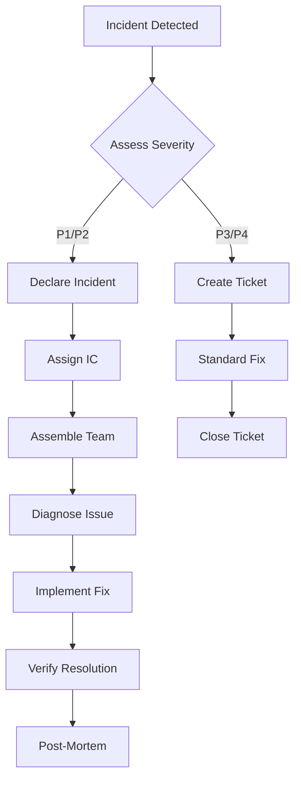

# Incident Response Playbook - Must Be Viral V2

## Quick Reference Card

### Severity Levels

| Level | Response Time | Examples | Escalation |
|-------|---------------|----------|------------|
| **P1 - Critical** | 15 min | Complete outage, data breach, payment system down | Immediate - All hands |
| **P2 - High** | 30 min | Partial outage, major feature broken, high error rate | Team lead + On-call |
| **P3 - Medium** | 2 hours | Minor feature issue, performance degradation | On-call engineer |
| **P4 - Low** | 24 hours | Cosmetic issues, minor bugs | Next business day |

### Emergency Contacts

| Role | Primary | Backup | Phone |
|------|---------|--------|-------|
| Incident Commander | [Name] | [Name] | [Phone] |
| Tech Lead | [Name] | [Name] | [Phone] |
| Security Lead | [Name] | [Name] | [Phone] |
| Database Admin | [Name] | [Name] | [Phone] |
| DevOps Lead | [Name] | [Name] | [Phone] |
| Customer Success | [Name] | [Name] | [Phone] |
| Legal Counsel | [Name] | [Name] | [Phone] |

### Emergency Command Center

- **Slack Channel**: #incident-response
- **War Room**: [Zoom Link]
- **Status Page**: https://status.mustbeviral.com
- **Runbook Wiki**: [Internal Link]

---

## Incident Response Process



## Phase 1: Detection & Triage

### Automatic Detection Triggers

```yaml
# Monitoring alerts that trigger incident response
triggers:
  - name: "Complete Service Outage"
    condition: "All health checks failing"
    severity: P1

  - name: "High Error Rate"
    condition: "Error rate > 10% for 5 minutes"
    severity: P2

  - name: "Database Connection Failure"
    condition: "Database unreachable"
    severity: P1

  - name: "Payment Processing Failure"
    condition: "Stripe webhook errors > 5 in 1 minute"
    severity: P1

  - name: "Security Breach Detected"
    condition: "Unauthorized access patterns"
    severity: P1
```

### Initial Assessment Checklist

```bash
#!/bin/bash
# Quick assessment script

echo "=== Incident Initial Assessment ==="
echo "Time: $(date)"

# 1. Service Status
echo -e "\n[1] Checking service status..."
curl -s https://api.mustbeviral.com/health || echo "API DOWN"
curl -s https://mustbeviral.com || echo "Website DOWN"

# 2. Error Rates
echo -e "\n[2] Checking error rates..."
curl -s http://prometheus:9090/api/v1/query?query=rate(http_errors_total[5m])

# 3. Database Status
echo -e "\n[3] Checking database..."
psql $DATABASE_URL -c "SELECT 1" || echo "Database UNREACHABLE"

# 4. Recent Deployments
echo -e "\n[4] Recent deployments..."
git log --oneline -n 5

# 5. Active Alerts
echo -e "\n[5] Active alerts..."
curl -s http://alertmanager:9093/api/v1/alerts

echo -e "\n=== Assessment Complete ==="
```

## Phase 2: Incident Declaration

### Incident Commander Responsibilities

1. **Take Command**
   ```
   @channel I am declaring a P[1-4] incident and taking IC.
   Issue: [Brief description]
   Impact: [User impact]
   Current Status: Investigating
   ```

2. **Assemble Team**
   ```
   Need assistance from:
   - Engineering: @[engineer]
   - Database: @[dba]
   - Security: @[security]
   Join war room: [Zoom link]
   ```

3. **Establish Communication**
   - Create incident Slack channel: #inc-YYYYMMDD-description
   - Start recording/logging all actions
   - Update status page

### Incident Response Template

```markdown
## Incident: [Title]
**ID**: INC-[YYYYMMDD]-[NUMBER]
**Severity**: P[1-4]
**Status**: [Investigating|Identified|Monitoring|Resolved]
**IC**: @[name]

### Timeline
- **[HH:MM]** - Incident detected via [source]
- **[HH:MM]** - IC assigned
- **[HH:MM]** - [Action taken]

### Impact
- **Users Affected**: [number/%]
- **Services**: [list affected services]
- **Duration**: [ongoing/resolved]

### Current Actions
- [ ] Investigating root cause
- [ ] Implementing fix
- [ ] Monitoring recovery

### Updates
- **[HH:MM]** - [Update]
```

## Phase 3: Diagnosis & Mitigation

### Diagnosis Runbooks

#### 1. Service Outage

```bash
# Service Outage Diagnosis
SERVICE="mustbeviral-app"

# Check container status
docker ps -a | grep $SERVICE

# Check recent logs
docker logs --tail 100 $SERVICE

# Check resource usage
docker stats --no-stream $SERVICE

# Check network connectivity
docker exec $SERVICE ping -c 3 8.8.8.8

# Check disk space
df -h

# Check memory
free -h

# Recent errors in application logs
grep -i error /var/log/mustbeviral/*.log | tail -20
```

#### 2. Database Issues

```sql
-- Database Diagnosis Queries

-- Connection count
SELECT count(*) FROM pg_stat_activity;

-- Long running queries
SELECT
    pid,
    now() - pg_stat_activity.query_start AS duration,
    query,
    state
FROM pg_stat_activity
WHERE (now() - pg_stat_activity.query_start) > interval '5 minutes';

-- Lock information
SELECT
    l.relation::regclass,
    l.mode,
    l.granted,
    a.query
FROM pg_locks l
JOIN pg_stat_activity a ON l.pid = a.pid
WHERE NOT l.granted;

-- Table sizes
SELECT
    schemaname,
    tablename,
    pg_size_pretty(pg_total_relation_size(schemaname||'.'||tablename)) AS size
FROM pg_tables
ORDER BY pg_total_relation_size(schemaname||'.'||tablename) DESC
LIMIT 10;

-- Index usage
SELECT
    schemaname,
    tablename,
    indexname,
    idx_scan,
    idx_tup_read,
    idx_tup_fetch
FROM pg_stat_user_indexes
ORDER BY idx_scan DESC;
```

#### 3. High Error Rate

```javascript
// Error Analysis Script
const axios = require('axios');

async function analyzeErrors() {
  // Get error metrics from Prometheus
  const query = `
    topk(10,
      sum by (endpoint, status) (
        rate(http_errors_total[5m])
      )
    )
  `;

  const response = await axios.get('http://prometheus:9090/api/v1/query', {
    params: { query }
  });

  console.log('Top Error Endpoints:');
  response.data.data.result.forEach(metric => {
    console.log(`${metric.metric.endpoint}: ${metric.value[1]} errors/sec`);
  });

  // Get recent error logs
  const errorLogs = await axios.get('http://elasticsearch:9200/mustbeviral-*/_search', {
    data: {
      query: {
        bool: {
          must: [
            { term: { level: 'ERROR' }},
            { range: { '@timestamp': { gte: 'now-15m' }}}
          ]
        }
      },
      size: 100,
      sort: [{ '@timestamp': 'desc' }]
    }
  });

  console.log('\nRecent Errors:');
  errorLogs.data.hits.hits.forEach(hit => {
    console.log(`[${hit._source['@timestamp']}] ${hit._source.message}`);
  });
}

analyzeErrors();
```

### Mitigation Actions

#### Quick Fixes

```bash
# 1. Restart Service
docker-compose restart mustbeviral-app

# 2. Scale Up
docker-compose scale mustbeviral-app=5

# 3. Clear Cache
redis-cli FLUSHALL

# 4. Enable Maintenance Mode
export MAINTENANCE_MODE=true
kubectl set env deployment/mustbeviral-app MAINTENANCE_MODE=true

# 5. Rollback Deployment
./scripts/rollback.sh [previous-version]

# 6. Increase Rate Limits Temporarily
redis-cli SET "ratelimit:global:limit" 1000 EX 3600

# 7. Disable Problematic Feature
export FEATURE_FLAG_NEW_FEATURE=false
```

#### Database Recovery

```bash
# Kill long-running queries
psql $DATABASE_URL -c "
  SELECT pg_terminate_backend(pid)
  FROM pg_stat_activity
  WHERE state = 'active'
    AND query_start < NOW() - INTERVAL '10 minutes'
    AND query NOT LIKE '%pg_stat_activity%';
"

# Vacuum and analyze
psql $DATABASE_URL -c "VACUUM ANALYZE;"

# Reset connections
psql $DATABASE_URL -c "
  SELECT pg_terminate_backend(pg_stat_activity.pid)
  FROM pg_stat_activity
  WHERE pg_stat_activity.datname = 'mustbeviral'
    AND pid <> pg_backend_pid();
"

# Emergency read-only mode
psql $DATABASE_URL -c "
  ALTER DATABASE mustbeviral SET default_transaction_read_only = on;
"
```

## Phase 4: Recovery & Verification

### Recovery Checklist

- [ ] Fix deployed/rolled back
- [ ] Services restarted
- [ ] Error rates returning to normal
- [ ] Response times acceptable
- [ ] All health checks passing
- [ ] Database queries running normally
- [ ] Cache warmed up
- [ ] Rate limits reset
- [ ] User reports stopping

### Verification Scripts

```bash
#!/bin/bash
# Recovery verification

echo "=== Verifying Recovery ==="

# Function to check metric
check_metric() {
    local name=$1
    local query=$2
    local threshold=$3
    local operator=$4

    value=$(curl -s "http://prometheus:9090/api/v1/query?query=$query" | jq -r '.data.result[0].value[1]')

    if (( $(echo "$value $operator $threshold" | bc -l) )); then
        echo "✓ $name: $value (OK)"
    else
        echo "✗ $name: $value (FAIL)"
        return 1
    fi
}

# Check error rate < 1%
check_metric "Error Rate" "rate(http_errors_total[5m])" "0.01" "<"

# Check response time < 500ms
check_metric "Response Time" "http_request_duration_seconds{quantile=\"0.95\"}" "0.5" "<"

# Check active users > 0
check_metric "Active Users" "active_users" "0" ">"

# Check all services up
services=("mustbeviral-app" "postgresql" "redis" "nginx")
for service in "${services[@]}"; do
    if docker ps | grep -q $service; then
        echo "✓ $service: Running"
    else
        echo "✗ $service: Not running"
    fi
done

echo "=== Verification Complete ==="
```

## Phase 5: Communication

### Internal Communication

```markdown
### Slack Updates (every 15-30 minutes)

**Update [HH:MM]**
Status: [Investigating|Identified|Fixing|Monitoring|Resolved]
Impact: [Current user impact]
Progress: [What's being done]
ETA: [Estimated resolution time]
```

### External Communication (Status Page)

#### Initial Notice
```markdown
**Investigating** - We are aware of an issue affecting [service].
Our team is actively investigating. More updates to follow.
```

#### Update
```markdown
**Identified** - We have identified the issue affecting [service].
A fix is being implemented. Current impact: [details].
Estimated resolution: [time].
```

#### Resolution
```markdown
**Resolved** - The issue affecting [service] has been resolved.
All systems are operational. We apologize for any inconvenience.
```

### Customer Communication Template

```markdown
Subject: [Service Status Update] - [Date]

Dear Customer,

We experienced a service disruption affecting [services] from [start time] to [end time] [timezone].

**What Happened:**
[Brief, non-technical explanation]

**Impact:**
[What users experienced]

**Resolution:**
[What we did to fix it]

**Prevention:**
[Steps we're taking to prevent recurrence]

We sincerely apologize for any inconvenience this may have caused.

If you continue to experience issues, please contact our support team.

Best regards,
Must Be Viral Team
```

## Phase 6: Post-Mortem

### Post-Mortem Template

```markdown
# Post-Mortem: [Incident Title]

**Date**: [YYYY-MM-DD]
**Authors**: [Names]
**Status**: [Draft|Final]
**Incident ID**: INC-[YYYYMMDD]-[NUMBER]

## Executive Summary
[1-2 paragraphs summarizing the incident]

## Impact
- **Duration**: [Total time]
- **Users Affected**: [Number/%]
- **Revenue Impact**: [$amount if applicable]
- **SLA Impact**: [Yes/No]

## Timeline
| Time | Event |
|------|-------|
| HH:MM | Incident began |
| HH:MM | Alert triggered |
| HH:MM | IC assigned |
| HH:MM | Root cause identified |
| HH:MM | Fix deployed |
| HH:MM | Incident resolved |

## Root Cause Analysis

### What Went Wrong
[Detailed technical explanation]

### Why It Went Wrong
[5 Whys analysis]

### Contributing Factors
- [Factor 1]
- [Factor 2]

## Resolution
[How the incident was resolved]

## Lessons Learned

### What Went Well
- [Positive 1]
- [Positive 2]

### What Could Be Improved
- [Improvement 1]
- [Improvement 2]

## Action Items
| Action | Owner | Due Date | Status |
|--------|-------|----------|--------|
| [Action 1] | [Name] | [Date] | [Status] |
| [Action 2] | [Name] | [Date] | [Status] |

## Supporting Data
- [Links to graphs]
- [Links to logs]
- [Links to commits]
```

## Specific Incident Playbooks

### 1. Security Incident

```bash
#!/bin/bash
# Security Incident Response

echo "=== SECURITY INCIDENT RESPONSE ==="

# 1. Isolate affected systems
echo "[1] Isolating affected systems..."
iptables -I INPUT -s [suspicious_ip] -j DROP

# 2. Preserve evidence
echo "[2] Preserving evidence..."
mkdir -p /tmp/incident-evidence
cp -r /var/log/* /tmp/incident-evidence/
docker logs mustbeviral-app > /tmp/incident-evidence/app.log

# 3. Check for compromise
echo "[3] Checking for compromise..."
# Check for unauthorized users
cut -d: -f1 /etc/passwd | sort | uniq

# Check for suspicious processes
ps aux | grep -E "(nc|netcat|wget|curl)" | grep -v grep

# Check for unauthorized SSH keys
find /home -name "authorized_keys" -exec cat {} \;

# 4. Rotate credentials
echo "[4] Rotating credentials..."
# Generate new JWT secret
openssl rand -base64 64

# Update database passwords
psql $DATABASE_URL -c "ALTER USER mustbeviral WITH PASSWORD '[new_password]';"

# 5. Enable enhanced logging
echo "[5] Enabling enhanced logging..."
export LOG_LEVEL=DEBUG
export AUDIT_MODE=true

echo "=== SECURITY RESPONSE INITIATED ==="
```

### 2. Data Loss Incident

```bash
#!/bin/bash
# Data Recovery Playbook

echo "=== DATA RECOVERY PROCEDURE ==="

# 1. Stop writes to prevent further damage
echo "[1] Stopping writes..."
psql $DATABASE_URL -c "ALTER DATABASE mustbeviral SET default_transaction_read_only = on;"

# 2. Identify extent of data loss
echo "[2] Assessing data loss..."
psql $DATABASE_URL -c "
  SELECT
    schemaname,
    tablename,
    n_tup_ins,
    n_tup_upd,
    n_tup_del,
    last_vacuum
  FROM pg_stat_user_tables
  ORDER BY n_tup_del DESC;
"

# 3. Check for available backups
echo "[3] Checking backups..."
aws s3 ls s3://mustbeviral-backups/ --recursive | tail -10

# 4. Restore from backup
echo "[4] Restoring from backup..."
BACKUP_FILE=$(aws s3 ls s3://mustbeviral-backups/ | sort | tail -1 | awk '{print $4}')
aws s3 cp s3://mustbeviral-backups/$BACKUP_FILE /tmp/restore.sql.gz
gunzip /tmp/restore.sql.gz
psql $DATABASE_URL < /tmp/restore.sql

# 5. Verify restoration
echo "[5] Verifying restoration..."
psql $DATABASE_URL -c "SELECT COUNT(*) FROM users;"
psql $DATABASE_URL -c "SELECT COUNT(*) FROM content;"

echo "=== RECOVERY COMPLETE ==="
```

### 3. Performance Degradation

```typescript
// Performance Investigation Script
import { performance } from 'perf_hooks';

class PerformanceInvestigator {
  async investigate() {
    console.log('=== Performance Investigation ===\n');

    // 1. Check response times
    await this.checkResponseTimes();

    // 2. Check database performance
    await this.checkDatabasePerformance();

    // 3. Check cache effectiveness
    await this.checkCachePerformance();

    // 4. Check resource utilization
    await this.checkResourceUtilization();

    // 5. Identify bottlenecks
    await this.identifyBottlenecks();
  }

  async checkResponseTimes() {
    const endpoints = [
      '/api/health',
      '/api/content/public',
      '/api/auth/status'
    ];

    for (const endpoint of endpoints) {
      const start = performance.now();
      await fetch(`https://api.mustbeviral.com${endpoint}`);
      const duration = performance.now() - start;

      console.log(`${endpoint}: ${duration.toFixed(2)}ms`);

      if (duration > 1000) {
        console.log(`  ⚠️ SLOW - Investigating...`);
        await this.profileEndpoint(endpoint);
      }
    }
  }

  async profileEndpoint(endpoint: string) {
    // Add APM tracing
    const trace = await fetch(`https://api.mustbeviral.com${endpoint}`, {
      headers: { 'X-Trace': 'true' }
    });

    const traceData = await trace.json();
    console.log(`  Breakdown:`, traceData.timing);
  }

  async checkDatabasePerformance() {
    const queries = [
      'SELECT COUNT(*) FROM users',
      'SELECT * FROM content ORDER BY created_at DESC LIMIT 10',
      'SELECT COUNT(*) FROM analytics WHERE date > NOW() - INTERVAL 1 DAY'
    ];

    for (const query of queries) {
      const result = await this.timeQuery(query);
      if (result.time > 100) {
        console.log(`  ⚠️ Slow query detected: ${query.substring(0, 50)}...`);
        await this.explainQuery(query);
      }
    }
  }

  async identifyBottlenecks() {
    // CPU bottleneck
    const cpuUsage = await this.getCPUUsage();
    if (cpuUsage > 80) {
      console.log('⚠️ HIGH CPU USAGE:', cpuUsage);
      await this.profileCPU();
    }

    // Memory bottleneck
    const memUsage = await this.getMemoryUsage();
    if (memUsage > 90) {
      console.log('⚠️ HIGH MEMORY USAGE:', memUsage);
      await this.analyzeMemory();
    }

    // Network bottleneck
    const networkLatency = await this.getNetworkLatency();
    if (networkLatency > 50) {
      console.log('⚠️ HIGH NETWORK LATENCY:', networkLatency);
    }
  }
}
```

## Automation Scripts

### Incident Auto-Response

```yaml
# .github/workflows/incident-response.yml
name: Automated Incident Response

on:
  webhook:
    types: [alert_triggered]

jobs:
  auto_response:
    runs-on: ubuntu-latest
    steps:
      - name: Assess Severity
        id: assess
        run: |
          SEVERITY=$(echo ${{ github.event.alert.severity }})
          echo "severity=$SEVERITY" >> $GITHUB_OUTPUT

      - name: Create Incident
        if: steps.assess.outputs.severity == 'P1' || steps.assess.outputs.severity == 'P2'
        run: |
          curl -X POST https://api.mustbeviral.com/incidents \
            -H "Authorization: Bearer ${{ secrets.API_TOKEN }}" \
            -d '{
              "title": "${{ github.event.alert.title }}",
              "severity": "${{ steps.assess.outputs.severity }}",
              "description": "${{ github.event.alert.description }}"
            }'

      - name: Page On-Call
        if: steps.assess.outputs.severity == 'P1'
        run: |
          curl -X POST https://api.pagerduty.com/incidents \
            -H "Authorization: Token token=${{ secrets.PAGERDUTY_TOKEN }}" \
            -d '{
              "incident": {
                "type": "incident",
                "title": "${{ github.event.alert.title }}",
                "service": {
                  "id": "MUSTBEVIRAL",
                  "type": "service_reference"
                },
                "urgency": "high"
              }
            }'

      - name: Enable Mitigation
        if: steps.assess.outputs.severity == 'P1'
        run: |
          # Enable circuit breakers
          kubectl set env deployment/mustbeviral-app CIRCUIT_BREAKER_ENABLED=true

          # Scale up
          kubectl scale deployment/mustbeviral-app --replicas=10

          # Enable caching
          kubectl set env deployment/mustbeviral-app AGGRESSIVE_CACHING=true
```

## Training & Drills

### Monthly Incident Drill

```markdown
## Incident Drill Scenario

**Scenario**: Database connection pool exhaustion during peak hours

**Inject**: At 14:00, simulate connection pool exhaustion:
```sql
-- Simulate connection exhaustion
DO $$
BEGIN
  FOR i IN 1..100 LOOP
    PERFORM pg_sleep(300);
  END LOOP;
END $$;
```

**Expected Response**:
1. Alert triggers within 2 minutes
2. IC assigned within 5 minutes
3. Diagnosis completed within 15 minutes
4. Mitigation applied within 20 minutes
5. Service restored within 30 minutes

**Evaluation Criteria**:
- [ ] Correct severity assessment
- [ ] Proper escalation
- [ ] Effective communication
- [ ] Successful mitigation
- [ ] Post-mortem completed
```

## Key Metrics

### Incident Metrics to Track

- **MTTD** (Mean Time To Detect): Target < 5 minutes
- **MTTA** (Mean Time To Acknowledge): Target < 15 minutes
- **MTTR** (Mean Time To Resolve): Target < 60 minutes
- **Incident Rate**: Target < 2 per month
- **Post-Mortem Completion**: Target 100% for P1/P2

---

**Remember**: The goal of incident response is to restore service as quickly as possible while learning to prevent future incidents. Stay calm, communicate clearly, and document everything.