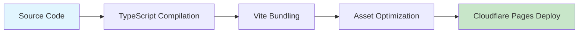
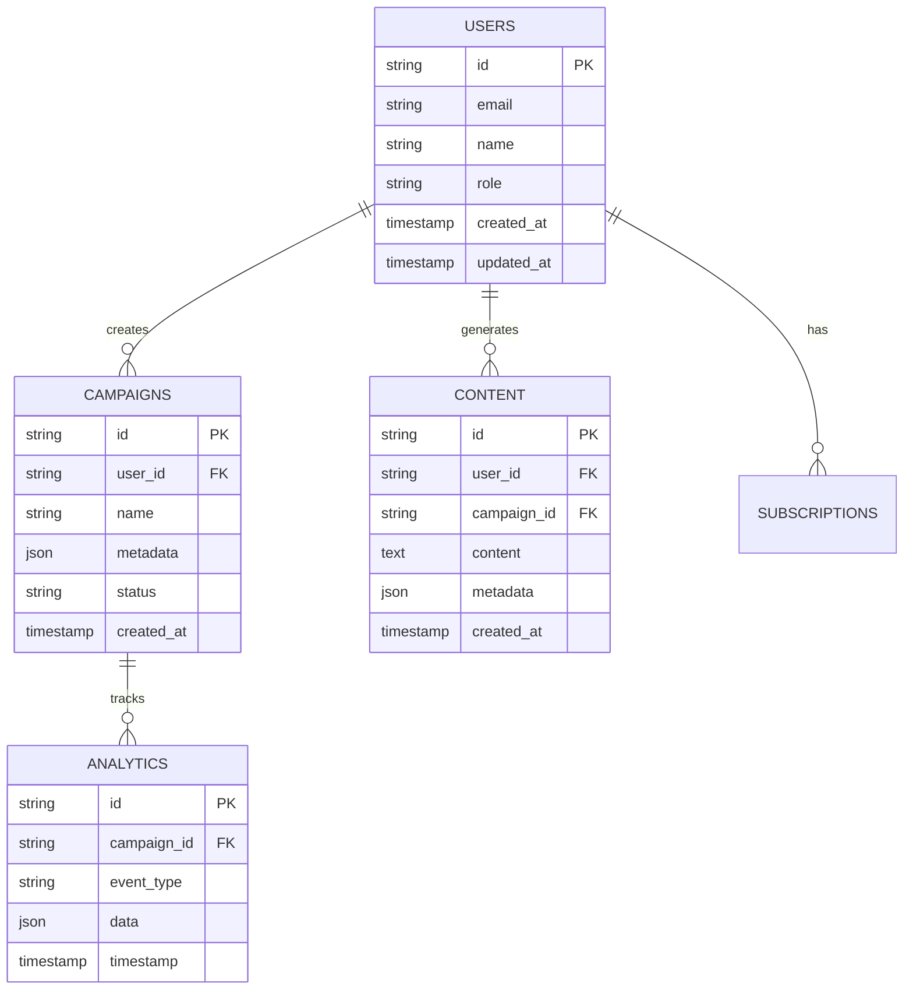

# Architecture Overview - Must Be Viral V2

## Architectural Principles

Must Be Viral V2 is designed around five core architectural principles:

1. **Edge-First Computing**: Leverage global edge networks for minimal latency
2. **Serverless by Default**: Auto-scaling, pay-per-use infrastructure
3. **API-First Design**: Clean separation between frontend and backend
4. **Data Near Users**: Intelligent data placement for performance
5. **Security by Design**: Zero-trust architecture with defense in depth

## System Architecture Layers

### 1. Presentation Layer (Frontend)

#### React Application Architecture (`src/App.tsx`)
```
App.tsx
├── Providers/
│   ├── QueryClient (TanStack Query)
│   ├── AuthProvider (Zustand)
│   └── ThemeProvider (CSS-in-JS)
├── Pages/
│   ├── HomePage
│   ├── Dashboard
│   ├── LoginPage
│   └── DesignSystemDemo
├── Components/
│   ├── NavBar
│   ├── Analytics
│   ├── BoostDashboard
│   └── OnboardFlow
└── Hooks/
    ├── useAuth
    ├── useAnalytics
    └── useContent
```

#### Frontend Technology Stack
- **React 18.3.1**: Modern React with concurrent features
- **TypeScript 5.5.3**: Type safety and developer experience
- **Vite 7.1.6**: Fast build tool with HMR
- **TailwindCSS 3.4.1**: Utility-first CSS framework
- **TanStack Query 5.89.0**: Server state management
- **Zustand 5.0.8**: Client state management
- **Wouter 3.7.1**: Minimal routing library

#### Build & Deployment Pipeline


### 2. Edge Computing Layer (Cloudflare Workers)

#### Worker Architecture (`src/worker.ts`)
```typescript
// Main Worker Entry Point
export default {
  async fetch(request: Request, env: Env): Promise<Response> {
    // Request routing and middleware
    const router = new Hono()

    // Authentication middleware
    router.use('*', authMiddleware)

    // API routes
    router.route('/api/auth', authRoutes)
    router.route('/api/content', contentRoutes)
    router.route('/api/analytics', analyticsRoutes)

    return router.fetch(request, env)
  }
}
```

#### Edge Services Architecture
- **API Gateway**: Request routing and middleware
- **Authentication Service**: JWT validation and OAuth
- **Content Generation**: AI-powered content creation
- **Analytics Processor**: Real-time event processing
- **Cache Manager**: Multi-layer caching strategy

### 3. Data Architecture

#### Database Design (Cloudflare D1)
The system uses a normalized relational design with the following key entities:



#### Storage Strategy
1. **Structured Data (D1)**: User profiles, campaigns, analytics
2. **Session Data (KV)**: Authentication tokens, temporary state
3. **Cache Data (KV)**: API responses, computed results
4. **Media Assets (R2)**: Images, videos, generated content
5. **Vector Data (Vectorize)**: Content embeddings for ML

### 4. Service Layer Architecture

#### Microservices Design Pattern
Each service is independently deployable and follows single responsibility principle:

```
Authentication Service
├── JWT token management
├── OAuth provider integration
├── Role-based access control
└── Session persistence

Content Generation Service
├── AI model integration
├── Template management
├── Brand voice customization
└── Content optimization

Analytics Service
├── Event collection
├── Real-time processing
├── Metric aggregation
└── Report generation

Campaign Management Service
├── Workflow orchestration
├── Project tracking
├── Collaboration tools
└── Asset organization
```

### 5. Integration Layer

#### External API Management
- **Rate Limiting**: Per-service quotas and circuit breakers
- **Retry Logic**: Exponential backoff with jitter
- **Caching**: Intelligent response caching
- **Monitoring**: Health checks and alerting

#### Third-Party Integrations
```typescript
// Example: Social Media API Integration
class SocialMediaService {
  private twitter: TwitterAPI
  private instagram: InstagramAPI
  private tiktok: TikTokAPI

  async publishContent(platform: string, content: Content): Promise<Result> {
    const strategy = this.getStrategy(platform)
    return await strategy.publish(content)
  }
}
```

## Deployment Architecture

### Environment Strategy

#### Development Environment
- **Frontend**: Vite dev server (localhost:5173)
- **Backend**: Wrangler dev server (localhost:8787)
- **Database**: Local D1 instance
- **Storage**: Local R2 emulation

#### Staging Environment
- **Frontend**: Cloudflare Pages preview
- **Backend**: Cloudflare Workers preview
- **Database**: Staging D1 database
- **Storage**: Preview R2 buckets

#### Production Environment
- **Frontend**: Cloudflare Pages (global CDN)
- **Backend**: Cloudflare Workers (280+ locations)
- **Database**: Production D1 (multi-region)
- **Storage**: Production R2 (global distribution)

### Infrastructure as Code

#### Wrangler Configuration (`wrangler.toml`)
```toml
# Production deployment configuration
[env.production]
name = "must-be-viral-prod"
vars = { ENVIRONMENT = "production" }

# Database binding
[[d1_databases]]
binding = "DB"
database_name = "must-be-viral-db"

# KV namespaces for different data types
[[kv_namespaces]]
binding = "USER_SESSIONS"
id = "production-sessions-id"

# R2 storage for assets
[[r2_buckets]]
binding = "ASSETS_STORAGE"
bucket_name = "must-be-viral-assets"
```

## Performance Architecture

### Caching Strategy
1. **Browser Cache**: Static assets (365 days)
2. **CDN Cache**: API responses (1 hour)
3. **Edge Cache**: Dynamic content (5 minutes)
4. **Application Cache**: Database queries (30 seconds)

### Load Balancing
- **Geographic Distribution**: Automatic edge routing
- **Request Distribution**: Round-robin with health checks
- **Failover**: Automatic region failover
- **Scaling**: Auto-scaling based on CPU and memory

### Performance Monitoring
```typescript
// Performance measurement example
const performanceMiddleware = async (c: Context, next: Next) => {
  const start = Date.now()
  await next()
  const duration = Date.now() - start

  // Track performance metrics
  await c.env.ANALYTICS.put(
    `performance:${c.req.path}`,
    JSON.stringify({ duration, timestamp: start })
  )
}
```

## Security Architecture

### Zero-Trust Security Model
1. **Identity Verification**: Multi-factor authentication
2. **Device Trust**: Device fingerprinting and validation
3. **Network Security**: Encrypted communication (TLS 1.3)
4. **Application Security**: Input validation and output encoding
5. **Data Security**: Encryption at rest and in transit

### Security Controls Matrix

| Layer | Control | Implementation |
|-------|---------|----------------|
| Edge | DDoS Protection | Cloudflare WAF |
| Application | Authentication | JWT + OAuth |
| API | Rate Limiting | KV-based counters |
| Data | Encryption | AES-256 |
| Network | TLS | TLS 1.3 minimum |

### Threat Model
- **OWASP Top 10**: Comprehensive coverage implemented
- **Data Breaches**: Encryption and access controls
- **API Abuse**: Rate limiting and authentication
- **Injection Attacks**: Input validation and parameterized queries
- **XSS/CSRF**: Content Security Policy and CSRF tokens

## Observability Architecture

### Distributed Tracing (`src/lib/monitoring/`)
```typescript
// OpenTelemetry integration
import { trace } from '@opentelemetry/api'

const tracer = trace.getTracer('must-be-viral')

export const tracedFunction = async (operation: string) => {
  const span = tracer.startSpan(operation)
  try {
    // Business logic
    return await businessLogic()
  } finally {
    span.end()
  }
}
```

### Monitoring Stack
- **Application Metrics**: Custom business metrics
- **Infrastructure Metrics**: Cloudflare analytics
- **Error Tracking**: Automatic error reporting
- **User Experience**: Real user monitoring

### Alerting Strategy
- **Critical Alerts**: Immediate notification (< 1 minute)
- **Warning Alerts**: Notification within 5 minutes
- **Info Alerts**: Daily summary reports
- **Escalation**: Automatic escalation after 15 minutes

## Scalability Design

### Horizontal Scaling
- **Stateless Services**: All services designed to be stateless
- **Database Scaling**: Read replicas and connection pooling
- **Cache Scaling**: Distributed caching with consistent hashing
- **Queue Processing**: Asynchronous job processing

### Vertical Scaling
- **Resource Allocation**: Dynamic resource allocation
- **Memory Management**: Efficient memory usage patterns
- **CPU Optimization**: Performance-critical code optimization
- **I/O Optimization**: Async I/O and connection pooling

### Capacity Planning
- **Traffic Patterns**: Analysis of peak and off-peak usage
- **Growth Projections**: 10x growth capacity planning
- **Cost Optimization**: Right-sizing resources for cost efficiency
- **Performance Targets**: SLA-driven capacity allocation

---

*Architecture decisions documented with rationale and trade-offs*
*Performance characteristics validated through load testing*
*Security design reviewed against OWASP ASVS standards*