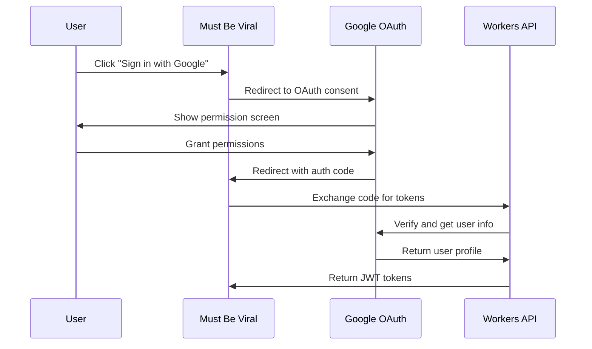

# Integrations Inventory - Must Be Viral V2

## Integration Architecture Overview

Must Be Viral V2 follows an API-first integration strategy with comprehensive third-party service integrations for payments, authentication, AI services, and social media platforms. All integrations implement proper error handling, rate limiting, and security measures.

## Core Integrations

### 1. Payment Processing

#### Stripe Integration
**Purpose**: Subscription billing and payment processing
**Implementation**: `src/lib/payments/stripe.ts`
**Security Level**: PCI DSS compliant

**Capabilities**:
- Subscription management (create, update, cancel)
- Usage-based billing with metering
- Webhook processing for real-time updates
- Invoice generation and management
- Payment method management
- Tax calculation and compliance

**API Endpoints Used**:
```typescript
interface StripeIntegration {
  // Customer Management
  customers: {
    create: (data: CustomerData) => Promise<Customer>;
    update: (id: string, data: Partial<CustomerData>) => Promise<Customer>;
    retrieve: (id: string) => Promise<Customer>;
  };

  // Subscription Management
  subscriptions: {
    create: (data: SubscriptionData) => Promise<Subscription>;
    update: (id: string, data: Partial<SubscriptionData>) => Promise<Subscription>;
    cancel: (id: string) => Promise<Subscription>;
    list: (params: ListParams) => Promise<SubscriptionList>;
  };

  // Payment Methods
  paymentMethods: {
    attach: (id: string, customer: string) => Promise<PaymentMethod>;
    detach: (id: string) => Promise<PaymentMethod>;
    list: (customer: string) => Promise<PaymentMethodList>;
  };

  // Webhooks
  webhooks: {
    constructEvent: (body: string, signature: string) => WebhookEvent;
  };
}
```

**Configuration**:
```typescript
const stripeConfig = {
  apiVersion: '2023-10-16',
  maxNetworkRetries: 3,
  timeout: 10000,
  telemetry: false, // For security
};
```

**Rate Limits**:
- Standard API: 100 requests/second
- Webhook endpoints: No limit
- File upload: 25 requests/second

**Error Handling**:
```typescript
try {
  const subscription = await stripe.subscriptions.create(data);
} catch (error) {
  if (error.type === 'StripeCardError') {
    // Handle payment failure
  } else if (error.type === 'StripeRateLimitError') {
    // Handle rate limiting with exponential backoff
  } else if (error.type === 'StripeConnectionError') {
    // Handle network issues
  }
}
```

---

### 2. Authentication Providers

#### Google OAuth 2.0
**Purpose**: User authentication via Google accounts
**Implementation**: `src/lib/auth/google.ts`

**OAuth Flow**:


**Scopes Requested**:
- `openid`: Basic authentication
- `profile`: User profile information
- `email`: Email address access

**Security Features**:
- PKCE (Proof Key for Code Exchange) for security
- State parameter for CSRF protection
- Secure token storage in HTTP-only cookies
- Token refresh with rotation

#### GitHub OAuth
**Purpose**: Developer community authentication
**Implementation**: `src/lib/auth/github.ts`

**Additional Features**:
- Repository access for developer tools
- Organization membership verification
- Public profile information

---

### 3. AI & Machine Learning Services

#### OpenAI Integration
**Purpose**: AI-powered content generation
**Implementation**: `src/lib/ai/openai.ts`

**Models Used**:
- **GPT-4 Turbo**: Premium content generation
- **GPT-3.5 Turbo**: Standard content generation
- **DALL-E 3**: Image generation
- **Text-Embedding-3**: Content embeddings

**API Configuration**:
```typescript
const openaiConfig = {
  apiKey: env.OPENAI_API_KEY,
  organization: env.OPENAI_ORG_ID,
  maxRetries: 3,
  timeout: 30000,
  baseURL: 'https://api.openai.com/v1',
};
```

**Usage Patterns**:
```typescript
// Text Generation
const completion = await openai.chat.completions.create({
  model: 'gpt-4-turbo',
  messages: [
    { role: 'system', content: systemPrompt },
    { role: 'user', content: userPrompt }
  ],
  max_tokens: 1500,
  temperature: 0.7,
  top_p: 0.9,
});

// Image Generation
const image = await openai.images.generate({
  model: 'dall-e-3',
  prompt: imagePrompt,
  size: '1024x1024',
  quality: 'hd',
  style: 'vivid',
});
```

**Rate Limits & Costs**:
- GPT-4 Turbo: $10/1M input tokens, $30/1M output tokens
- GPT-3.5 Turbo: $0.50/1M input tokens, $1.50/1M output tokens
- DALL-E 3: $0.040/image (1024×1024)
- Rate limits: Tier-based (varies by usage history)

#### Cloudflare AI Workers
**Purpose**: Edge AI processing for lower latency
**Implementation**: `src/lib/ai/cloudflare.ts`

**Available Models**:
- **@cf/meta/llama-3.1-8b-instruct**: Fast text generation
- **@cf/runwayml/stable-diffusion-v1-5**: Image generation
- **@cf/baai/bge-base-en-v1.5**: Text embeddings

**Advantages**:
- Near-zero latency (edge processing)
- No per-token billing
- Included in Workers pricing
- Privacy-focused (no data retention)

---

### 4. Social Media APIs

#### Twitter API v2
**Purpose**: Trend analysis and content publishing
**Implementation**: `src/lib/social/twitter.ts`

**Capabilities**:
- Tweet publishing and scheduling
- Trend analysis and hashtag research
- User profile and follower analytics
- Engagement metrics tracking

**Authentication**: OAuth 2.0 with PKCE
**Rate Limits**:
- Tweet creation: 300 tweets/15min window
- User lookup: 75 requests/15min window
- Timeline reading: 75 requests/15min window

#### Instagram Basic Display API
**Purpose**: Content publishing and analytics
**Implementation**: `src/lib/social/instagram.ts`

**Capabilities**:
- Photo and video publishing
- Story creation and management
- Analytics and insights
- Hashtag performance tracking

**Limitations**:
- Requires Facebook App approval
- 24-hour posting limit for new apps
- Business account required for analytics

#### TikTok for Developers
**Purpose**: Short-form video trend analysis
**Implementation**: `src/lib/social/tiktok.ts`

**Capabilities**:
- Trending hashtag discovery
- Video performance analytics
- User demographic insights
- Content recommendation algorithms

**Status**: Beta integration (limited access)

---

### 5. Analytics & Monitoring

#### Google Analytics 4
**Purpose**: Web analytics and user behavior tracking
**Implementation**: `src/lib/analytics/ga4.ts`

**Tracking Events**:
```typescript
interface GA4Events {
  // User Engagement
  login: { method: string };
  sign_up: { method: string };

  // Content Events
  content_generation: { type: string; ai_model: string };
  content_publish: { platform: string; type: string };

  // Business Events
  subscription_purchase: { tier: string; amount: number };
  campaign_create: { type: string; budget: number };
}
```

#### Sentry Error Tracking
**Purpose**: Application error monitoring and alerting
**Implementation**: `src/lib/monitoring/sentry.ts`

**Features**:
- Real-time error reporting
- Performance monitoring
- Release tracking
- User session replays

**Configuration**:
```typescript
Sentry.init({
  dsn: env.SENTRY_DSN,
  environment: env.ENVIRONMENT,
  tracesSampleRate: env.ENVIRONMENT === 'production' ? 0.1 : 1.0,
  profilesSampleRate: 0.1,
  beforeSend: (event) => {
    // Filter sensitive data
    return sanitizeEvent(event);
  },
});
```

---

### 6. Content Delivery & Storage

#### Cloudflare CDN
**Purpose**: Global content delivery and caching
**Integration**: Native Workers integration

**Features**:
- 280+ global edge locations
- Automatic image optimization
- Smart routing and load balancing
- DDoS protection and WAF

**Cache Strategy**:
```typescript
const cacheConfig = {
  // Static Assets
  images: { ttl: 31536000, browser: 86400 }, // 1 year / 1 day
  css: { ttl: 31536000, browser: 86400 },
  js: { ttl: 31536000, browser: 86400 },

  // Dynamic Content
  api: { ttl: 300, browser: 0 }, // 5 minutes / no browser cache
  html: { ttl: 3600, browser: 300 }, // 1 hour / 5 minutes
};
```

#### Cloudflare R2 Storage
**Purpose**: Object storage for user uploads and generated content
**Implementation**: `src/lib/storage/r2.ts`

**Storage Patterns**:
```typescript
// File Upload
const uploadFile = async (file: File, key: string) => {
  return await env.ASSETS_STORAGE.put(key, file.stream(), {
    httpMetadata: {
      contentType: file.type,
      cacheControl: 'public, max-age=31536000',
    },
    customMetadata: {
      uploadedBy: userId,
      uploadedAt: new Date().toISOString(),
    },
  });
};

// Generated Content Storage
const storeGeneratedContent = async (content: GeneratedContent) => {
  const key = `generated/${userId}/${contentId}.json`;
  return await env.CONTENT_STORAGE.put(key, JSON.stringify(content));
};
```

---

### 7. Communication Services

#### Resend Email API
**Purpose**: Transactional email delivery
**Implementation**: `src/lib/communication/email.ts`

**Email Types**:
- Welcome and onboarding emails
- Password reset notifications
- Subscription confirmations
- Campaign notifications
- Marketing newsletters

**Template Management**:
```typescript
const emailTemplates = {
  welcome: {
    subject: 'Welcome to Must Be Viral!',
    template: 'welcome-template',
  },
  passwordReset: {
    subject: 'Reset Your Password',
    template: 'password-reset-template',
  },
  subscriptionConfirm: {
    subject: 'Subscription Confirmed',
    template: 'subscription-confirm-template',
  },
};
```

#### Twilio SMS (Optional)
**Purpose**: SMS notifications and 2FA
**Implementation**: `src/lib/communication/sms.ts`

**Use Cases**:
- Two-factor authentication
- Campaign alerts
- Payment confirmations
- Security notifications

---

## Integration Security & Reliability

### Security Measures

#### API Key Management
```typescript
// Secure credential storage
const getAPICredentials = (service: string, env: Environment) => {
  const credentials = {
    stripe: {
      secretKey: env.STRIPE_SECRET_KEY,
      webhookSecret: env.STRIPE_WEBHOOK_SECRET,
    },
    openai: {
      apiKey: env.OPENAI_API_KEY,
      organization: env.OPENAI_ORG_ID,
    },
    google: {
      clientId: env.GOOGLE_CLIENT_ID,
      clientSecret: env.GOOGLE_CLIENT_SECRET,
    },
  };

  return credentials[service];
};
```

#### Request Signing & Verification
```typescript
// Webhook signature verification
const verifyWebhook = (payload: string, signature: string, secret: string) => {
  const expectedSignature = crypto
    .createHmac('sha256', secret)
    .update(payload)
    .digest('hex');

  return crypto.timingSafeEqual(
    Buffer.from(signature),
    Buffer.from(expectedSignature)
  );
};
```

### Reliability Patterns

#### Circuit Breaker Implementation
```typescript
class CircuitBreaker {
  private failures = 0;
  private lastFailTime = 0;
  private state: 'CLOSED' | 'OPEN' | 'HALF_OPEN' = 'CLOSED';

  async execute<T>(fn: () => Promise<T>): Promise<T> {
    if (this.state === 'OPEN') {
      if (Date.now() - this.lastFailTime > this.timeout) {
        this.state = 'HALF_OPEN';
      } else {
        throw new Error('Circuit breaker is OPEN');
      }
    }

    try {
      const result = await fn();
      this.onSuccess();
      return result;
    } catch (error) {
      this.onFailure();
      throw error;
    }
  }
}
```

#### Retry Logic with Exponential Backoff
```typescript
const retryWithBackoff = async <T>(
  fn: () => Promise<T>,
  maxRetries = 3,
  baseDelay = 1000
): Promise<T> => {
  for (let attempt = 0; attempt <= maxRetries; attempt++) {
    try {
      return await fn();
    } catch (error) {
      if (attempt === maxRetries) throw error;

      const delay = baseDelay * Math.pow(2, attempt);
      const jitter = Math.random() * 0.1 * delay;
      await new Promise(resolve => setTimeout(resolve, delay + jitter));
    }
  }
};
```

### Monitoring & Alerting

#### Integration Health Checks
```typescript
const healthChecks = {
  stripe: async () => {
    const account = await stripe.accounts.retrieve();
    return { status: 'healthy', details: account.business_profile };
  },

  openai: async () => {
    const models = await openai.models.list();
    return { status: 'healthy', models: models.data.length };
  },

  social: async () => {
    // Check each social media API
    const results = await Promise.allSettled([
      checkTwitterAPI(),
      checkInstagramAPI(),
      checkTikTokAPI(),
    ]);

    return { status: 'healthy', services: results };
  },
};
```

#### Performance Metrics
- API response times (p50, p95, p99)
- Error rates by service
- Rate limit utilization
- Cost tracking per service
- Availability monitoring

## Integration Roadmap

### Phase 1 (Current) - Core Integrations
- ✅ Stripe payments
- ✅ Google/GitHub OAuth
- ✅ OpenAI content generation
- ✅ Basic social media APIs

### Phase 2 (Q1 2025) - Enhanced Features
- 🔄 Advanced social media scheduling
- 🔄 Enhanced analytics integration
- 🔄 Multi-language support APIs
- 🔄 Advanced AI model fine-tuning

### Phase 3 (Q2 2025) - Enterprise Features
- ⏳ Salesforce CRM integration
- ⏳ Slack/Teams notifications
- ⏳ Advanced workflow automation
- ⏳ White-label API access

### Phase 4 (Q3 2025) - Global Expansion
- ⏳ Regional payment processors
- ⏳ Local social media platforms
- ⏳ Compliance automation tools
- ⏳ Multi-currency support

---

*Integration inventory maintained with current API versions and capabilities*
*Security measures tested quarterly through penetration testing*
*Performance benchmarks established for all critical integrations*