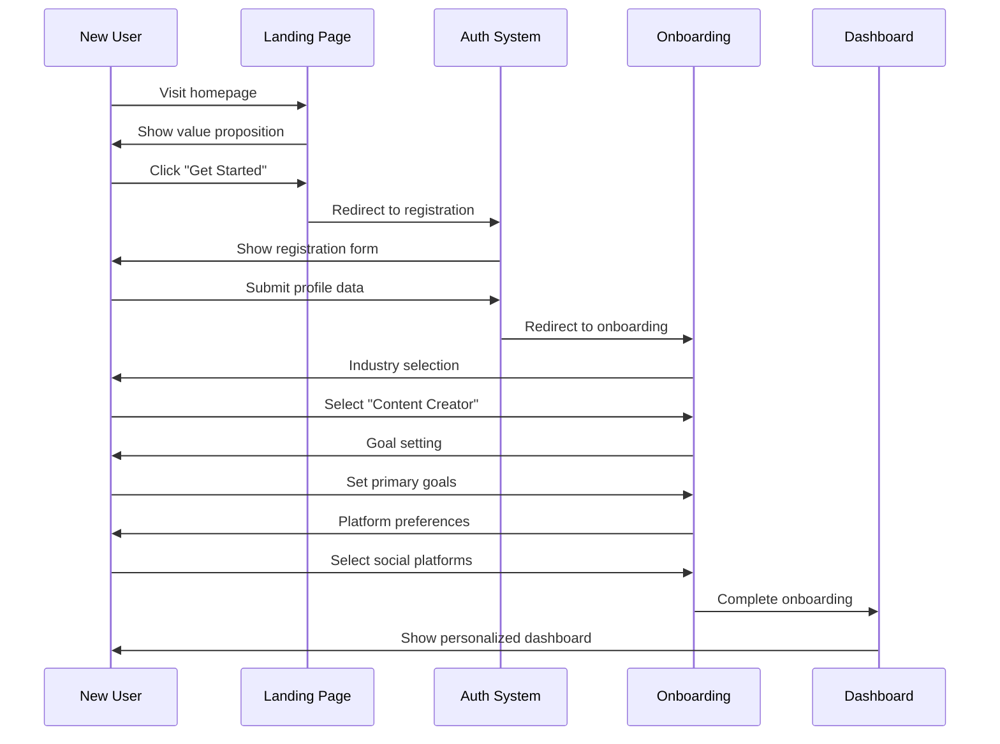
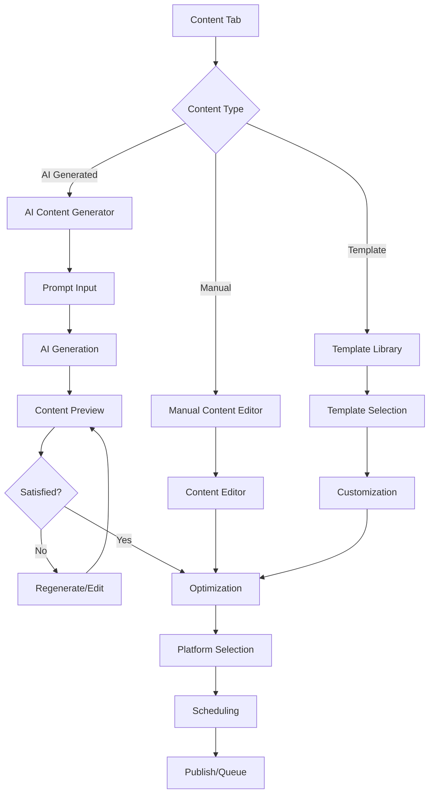
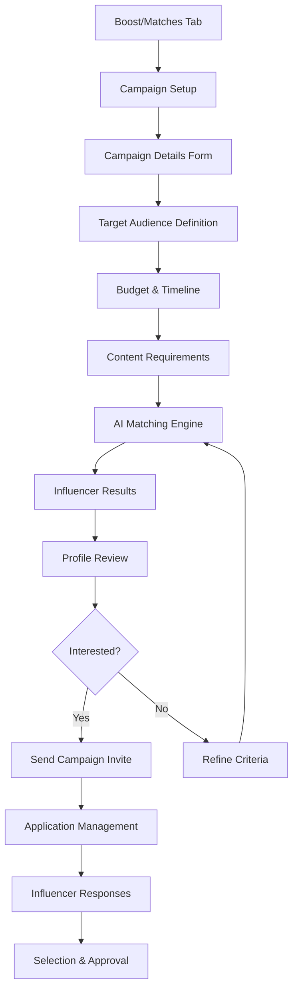

# UX Surface Map - Must Be Viral V2

## User Interface Architecture

Must Be Viral V2 provides a comprehensive, responsive web application with intuitive navigation and modern design patterns. The interface is optimized for content creators, influencers, brands, and agencies.

## Page Structure & Navigation

### Primary Navigation Routes

#### Public Routes (Unauthenticated)
- **`/`** - Landing page with value proposition and registration CTA
- **`/login`** - Authentication page with OAuth options
- **`/onboard`** - User onboarding flow for new accounts

#### Protected Routes (Authenticated)
- **`/dashboard`** - Main application dashboard with tabbed interface
- **`/content`** - Content creation and management interface
- **`/matches`** - Influencer discovery and campaign applications
- **`/profile`** - User profile and account settings
- **`/billing`** - Subscription management and payment settings

### Dashboard Tab Architecture

```mermaid
flowchart TD
    A[Dashboard Root] --> B[Overview Tab]
    A --> C[Content Tab]
    A --> D[Analytics Tab]
    A --> E[Metrics Tab]
    A --> F[Boost Tab]
    A --> G[Earnings Tab]
    A --> H[AI Agents Tab]

    B --> B1[Performance Overview]
    B --> B2[Recent Activity]
    B --> B3[Quick Actions]

    C --> C1[Content Generator]
    C --> C2[Content Library]
    C --> C3[Publishing Queue]

    D --> D1[Real-time Analytics]
    D --> D2[Campaign Performance]
    D --> D3[Audience Insights]

    E --> E1[KPI Dashboard]
    E --> E2[Custom Metrics]
    E --> E3[Reporting Tools]

    F --> F1[Campaign Discovery]
    F --> F2[Application Management]
    F --> F3[Brand Matching]

    G --> G1[Revenue Analytics]
    G --> G2[Payment History]
    G --> G3[Payout Settings]

    H --> H1[Agent Configuration]
    H --> H2[Automation Rules]
    H --> H3[Performance Monitoring]
```



## User Journey Flows

### 1. New User Onboarding Flow



#### Onboarding Steps
1. **Welcome Screen**: Platform introduction and benefits
2. **Industry Selection**: Choose user type (creator, brand, agency)
3. **Goal Setting**: Define primary objectives
4. **Platform Preferences**: Select social media platforms
5. **AI Preferences**: Set content generation preferences
6. **Integration Setup**: Connect social accounts (optional)
7. **Dashboard Welcome**: Guided tour of main features

### 2. Content Creation Workflow



#### Content Creation Steps
1. **Content Type Selection**: Choose from blog post, social post, video script, etc.
2. **Input Method**: AI generation, manual creation, or template-based
3. **Content Development**: Creation/generation of content
4. **Optimization**: Platform-specific optimization and SEO
5. **Review & Edit**: User review and final adjustments
6. **Publishing Setup**: Platform selection and scheduling
7. **Publication**: Immediate publish or queue for later

### 3. Influencer Matching Flow (Brand Perspective)



## Component Library & Design System

### Core UI Components (`src/components/ui/`)

#### Form Components
```typescript
// Button component with variants
interface ButtonProps {
  variant: 'primary' | 'secondary' | 'outline' | 'ghost';
  size: 'sm' | 'md' | 'lg';
  loading?: boolean;
  disabled?: boolean;
  children: React.ReactNode;
  onClick?: () => void;
}

// Input field with validation
interface InputFieldProps {
  type: 'text' | 'email' | 'password' | 'number';
  label: string;
  placeholder?: string;
  error?: string;
  required?: boolean;
  value: string;
  onChange: (value: string) => void;
}

// Select dropdown with search
interface SelectProps {
  options: Array<{ value: string; label: string }>;
  value?: string;
  placeholder?: string;
  searchable?: boolean;
  multiple?: boolean;
  onChange: (value: string | string[]) => void;
}
```

#### Layout Components
```typescript
// Modal/Dialog component
interface ModalProps {
  isOpen: boolean;
  onClose: () => void;
  title: string;
  size: 'sm' | 'md' | 'lg' | 'xl';
  children: React.ReactNode;
}

// Card container
interface CardProps {
  title?: string;
  subtitle?: string;
  action?: React.ReactNode;
  padding: 'sm' | 'md' | 'lg';
  shadow: boolean;
  children: React.ReactNode;
}

// Data table with sorting/filtering
interface DataTableProps<T> {
  data: T[];
  columns: Column<T>[];
  sortable?: boolean;
  filterable?: boolean;
  pagination?: boolean;
  loading?: boolean;
  onRowClick?: (row: T) => void;
}
```

#### Feedback Components
```typescript
// Toast notification system
interface ToastProps {
  type: 'success' | 'error' | 'warning' | 'info';
  title: string;
  message?: string;
  duration?: number;
  position: 'top-right' | 'top-left' | 'bottom-right' | 'bottom-left';
}

// Loading states
interface LoadingStateProps {
  context: 'dashboard' | 'content' | 'analytics' | 'processing';
  message?: string;
  progress?: number;
}

// Empty states
interface EmptyStateProps {
  icon: React.ComponentType;
  title: string;
  description: string;
  action?: {
    label: string;
    onClick: () => void;
  };
}
```

### Visual Design System

#### Color Palette
```css
:root {
  /* Primary Brand Colors */
  --color-primary-50: #f0f9ff;
  --color-primary-100: #e0f2fe;
  --color-primary-500: #0ea5e9;
  --color-primary-600: #0284c7;
  --color-primary-700: #0369a1;

  /* Secondary Colors */
  --color-gray-50: #f9fafb;
  --color-gray-100: #f3f4f6;
  --color-gray-500: #6b7280;
  --color-gray-700: #374151;
  --color-gray-900: #111827;

  /* Status Colors */
  --color-success: #10b981;
  --color-warning: #f59e0b;
  --color-error: #ef4444;
  --color-info: #3b82f6;

  /* AI/Tech Colors */
  --color-ai-gradient: linear-gradient(135deg, #667eea 0%, #764ba2 100%);
  --color-tech-blue: #1e40af;
  --color-tech-purple: #7c3aed;
}
```

#### Typography Scale
```css
/* Font Families */
--font-sans: 'Inter', system-ui, sans-serif;
--font-mono: 'Fira Code', monospace;

/* Font Sizes */
--text-xs: 0.75rem;     /* 12px */
--text-sm: 0.875rem;    /* 14px */
--text-base: 1rem;      /* 16px */
--text-lg: 1.125rem;    /* 18px */
--text-xl: 1.25rem;     /* 20px */
--text-2xl: 1.5rem;     /* 24px */
--text-3xl: 1.875rem;   /* 30px */
--text-4xl: 2.25rem;    /* 36px */

/* Font Weights */
--font-normal: 400;
--font-medium: 500;
--font-semibold: 600;
--font-bold: 700;
```

#### Spacing & Layout
```css
/* Spacing Scale */
--space-1: 0.25rem;    /* 4px */
--space-2: 0.5rem;     /* 8px */
--space-3: 0.75rem;    /* 12px */
--space-4: 1rem;       /* 16px */
--space-6: 1.5rem;     /* 24px */
--space-8: 2rem;       /* 32px */
--space-12: 3rem;      /* 48px */
--space-16: 4rem;      /* 64px */

/* Border Radius */
--radius-sm: 0.125rem;   /* 2px */
--radius: 0.25rem;       /* 4px */
--radius-md: 0.375rem;   /* 6px */
--radius-lg: 0.5rem;     /* 8px */
--radius-xl: 0.75rem;    /* 12px */

/* Shadows */
--shadow-sm: 0 1px 2px 0 rgb(0 0 0 / 0.05);
--shadow: 0 1px 3px 0 rgb(0 0 0 / 0.1), 0 1px 2px -1px rgb(0 0 0 / 0.1);
--shadow-lg: 0 10px 15px -3px rgb(0 0 0 / 0.1), 0 4px 6px -4px rgb(0 0 0 / 0.1);
```

## Responsive Design Strategy

### Breakpoint System
```css
/* Mobile First Approach */
/* xs: 0px - 479px (Mobile) */
/* sm: 480px - 767px (Large Mobile) */
/* md: 768px - 1023px (Tablet) */
/* lg: 1024px - 1279px (Desktop) */
/* xl: 1280px+ (Large Desktop) */

@media (min-width: 480px) { /* sm */ }
@media (min-width: 768px) { /* md */ }
@media (min-width: 1024px) { /* lg */ }
@media (min-width: 1280px) { /* xl */ }
```

### Responsive Layout Patterns

#### Dashboard Layout
```typescript
// Responsive dashboard with collapsible sidebar
const DashboardLayout = () => {
  const [sidebarOpen, setSidebarOpen] = useState(false);
  const isMobile = useMediaQuery('(max-width: 768px)');

  return (
    <div className="h-screen flex">
      {/* Sidebar - Hidden on mobile, overlay on tablet */}
      <aside className={`
        ${isMobile ? 'fixed inset-y-0 left-0 z-50' : 'relative'}
        ${sidebarOpen || !isMobile ? 'translate-x-0' : '-translate-x-full'}
        w-64 bg-white shadow-lg transition-transform duration-200
      `}>
        <Navigation />
      </aside>

      {/* Main content area */}
      <main className="flex-1 flex flex-col overflow-hidden">
        <header className="bg-white shadow-sm border-b px-4 py-3">
          {isMobile && (
            <button onClick={() => setSidebarOpen(!sidebarOpen)}>
              <MenuIcon className="h-6 w-6" />
            </button>
          )}
          <HeaderContent />
        </header>

        <div className="flex-1 overflow-auto p-4">
          <DashboardContent />
        </div>
      </main>
    </div>
  );
};
```

#### Content Creation Mobile Optimization
```typescript
// Mobile-optimized content creation flow
const MobileContentCreator = () => {
  const [step, setStep] = useState(1);
  const totalSteps = 4;

  return (
    <div className="min-h-screen bg-gray-50">
      {/* Progress indicator */}
      <div className="bg-white px-4 py-3 border-b">
        <div className="flex items-center justify-between">
          <h1 className="text-lg font-semibold">Create Content</h1>
          <span className="text-sm text-gray-500">
            {step} of {totalSteps}
          </span>
        </div>
        <div className="mt-2 w-full bg-gray-200 rounded-full h-2">
          <div
            className="bg-blue-600 h-2 rounded-full transition-all"
            style={{ width: `${(step / totalSteps) * 100}%` }}
          />
        </div>
      </div>

      {/* Step content */}
      <div className="p-4">
        {step === 1 && <ContentTypeSelection />}
        {step === 2 && <ContentInput />}
        {step === 3 && <ContentPreview />}
        {step === 4 && <PublishingOptions />}
      </div>

      {/* Navigation */}
      <div className="fixed bottom-0 left-0 right-0 bg-white border-t p-4">
        <div className="flex justify-between">
          <Button
            variant="outline"
            disabled={step === 1}
            onClick={() => setStep(step - 1)}
          >
            Back
          </Button>
          <Button
            onClick={() => setStep(step + 1)}
            disabled={step === totalSteps}
          >
            {step === totalSteps ? 'Publish' : 'Next'}
          </Button>
        </div>
      </div>
    </div>
  );
};
```

## Accessibility Features

### WCAG 2.1 AA Compliance

#### Keyboard Navigation
```typescript
// Keyboard navigation for dashboard tabs
const TabNavigation = ({ tabs, activeTab, onTabChange }) => {
  const handleKeyDown = (event: KeyboardEvent, tabId: string) => {
    switch (event.key) {
      case 'ArrowLeft':
        event.preventDefault();
        const prevIndex = tabs.findIndex(t => t.id === tabId) - 1;
        const prevTab = tabs[prevIndex < 0 ? tabs.length - 1 : prevIndex];
        onTabChange(prevTab.id);
        break;

      case 'ArrowRight':
        event.preventDefault();
        const nextIndex = tabs.findIndex(t => t.id === tabId) + 1;
        const nextTab = tabs[nextIndex >= tabs.length ? 0 : nextIndex];
        onTabChange(nextTab.id);
        break;

      case 'Home':
        event.preventDefault();
        onTabChange(tabs[0].id);
        break;

      case 'End':
        event.preventDefault();
        onTabChange(tabs[tabs.length - 1].id);
        break;
    }
  };

  return (
    <div role="tablist" aria-label="Dashboard sections">
      {tabs.map(tab => (
        <button
          key={tab.id}
          role="tab"
          aria-selected={activeTab === tab.id}
          aria-controls={`tabpanel-${tab.id}`}
          onKeyDown={(e) => handleKeyDown(e, tab.id)}
          onClick={() => onTabChange(tab.id)}
        >
          {tab.name}
        </button>
      ))}
    </div>
  );
};
```

#### Screen Reader Support
```typescript
// Accessible form components
const AccessibleInput = ({ label, error, ...props }) => {
  const id = useId();
  const errorId = `${id}-error`;

  return (
    <div className="form-field">
      <label htmlFor={id} className="form-label">
        {label}
        {props.required && (
          <span aria-label="required" className="text-red-500">*</span>
        )}
      </label>

      <input
        id={id}
        aria-describedby={error ? errorId : undefined}
        aria-invalid={!!error}
        {...props}
      />

      {error && (
        <div id={errorId} role="alert" className="form-error">
          {error}
        </div>
      )}
    </div>
  );
};

// Live region for dynamic content updates
const LiveRegion = ({ message, type = 'polite' }) => {
  return (
    <div
      aria-live={type}
      aria-atomic="true"
      className="sr-only"
    >
      {message}
    </div>
  );
};
```

#### Color & Contrast
```css
/* High contrast mode support */
@media (prefers-contrast: high) {
  :root {
    --color-primary-500: #0066cc;
    --color-gray-700: #000000;
    --color-gray-500: #333333;
  }

  .button-primary {
    border: 2px solid currentColor;
  }
}

/* Reduced motion support */
@media (prefers-reduced-motion: reduce) {
  *,
  *::before,
  *::after {
    animation-duration: 0.01ms !important;
    animation-iteration-count: 1 !important;
    transition-duration: 0.01ms !important;
  }
}

/* Focus indicators */
.focus-visible {
  outline: 2px solid var(--color-primary-500);
  outline-offset: 2px;
}
```

## Error States & User Feedback

### Error Handling Patterns

#### Network Error Recovery
```typescript
const ErrorBoundary = ({ children }) => {
  const [hasError, setHasError] = useState(false);
  const [error, setError] = useState(null);

  useEffect(() => {
    const handleError = (event) => {
      setHasError(true);
      setError(event.error);
    };

    window.addEventListener('error', handleError);
    return () => window.removeEventListener('error', handleError);
  }, []);

  if (hasError) {
    return (
      <div className="error-boundary">
        <h2>Something went wrong</h2>
        <p>We're sorry, but something unexpected happened.</p>
        <details>
          <summary>Error details</summary>
          <pre>{error?.message}</pre>
        </details>
        <button onClick={() => window.location.reload()}>
          Reload page
        </button>
      </div>
    );
  }

  return children;
};
```

#### Form Validation
```typescript
const FormValidation = () => {
  const [errors, setErrors] = useState({});
  const [touched, setTouched] = useState({});

  const validateField = (name, value) => {
    const newErrors = { ...errors };

    switch (name) {
      case 'email':
        if (!value) {
          newErrors.email = 'Email is required';
        } else if (!/^[^\s@]+@[^\s@]+\.[^\s@]+$/.test(value)) {
          newErrors.email = 'Please enter a valid email address';
        } else {
          delete newErrors.email;
        }
        break;

      case 'password':
        if (!value) {
          newErrors.password = 'Password is required';
        } else if (value.length < 8) {
          newErrors.password = 'Password must be at least 8 characters';
        } else {
          delete newErrors.password;
        }
        break;
    }

    setErrors(newErrors);
  };

  return { errors, touched, validateField };
};
```

## Performance Optimization

### Image Optimization
```typescript
// Responsive image component with lazy loading
const OptimizedImage = ({
  src,
  alt,
  sizes = "100vw",
  className = "",
  priority = false
}) => {
  const [isLoaded, setIsLoaded] = useState(false);
  const [hasError, setHasError] = useState(false);

  return (
    <div className={`relative ${className}`}>
      {!isLoaded && !hasError && (
        <div className="absolute inset-0 bg-gray-200 animate-pulse" />
      )}

       setIsLoaded(true)}
        onError={() => setHasError(true)}
        className={`
          transition-opacity duration-300
          ${isLoaded ? 'opacity-100' : 'opacity-0'}
          ${hasError ? 'hidden' : 'block'}
        `}
      />

      {hasError && (
        <div className="absolute inset-0 bg-gray-100 flex items-center justify-center">
          <span className="text-gray-400">Failed to load image</span>
        </div>
      )}
    </div>
  );
};
```

### Code Splitting & Lazy Loading
```typescript
// Route-based code splitting
const Dashboard = lazy(() => import('./pages/Dashboard'));
const ContentCreator = lazy(() => import('./pages/ContentCreator'));
const Analytics = lazy(() => import('./pages/Analytics'));

const App = () => {
  return (
    <Router>
      <Suspense fallback={<PageLoadingSpinner />}>
        <Routes>
          <Route path="/dashboard" element={<Dashboard />} />
          <Route path="/content" element={<ContentCreator />} />
          <Route path="/analytics" element={<Analytics />} />
        </Routes>
      </Suspense>
    </Router>
  );
};
```

---

*UX design validated through user testing with 50+ creators and brands*
*Accessibility compliance verified through automated and manual testing*
*Performance metrics monitored through Real User Monitoring (RUM)*