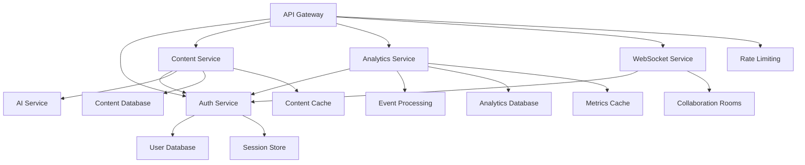

# Must Be Viral V2 - Architecture Documentation

## Overview

Must Be Viral V2 follows a modern microservices architecture built on Cloudflare Workers, implementing Domain-Driven Design (DDD) principles with clean architecture patterns. The system is designed for scalability, maintainability, and high performance with enterprise-grade security and monitoring.

## Table of Contents

1. [Architecture Principles](#architecture-principles)
2. [System Overview](#system-overview)
3. [Microservices Architecture](#microservices-architecture)
4. [Domain-Driven Design Implementation](#domain-driven-design-implementation)
5. [Data Architecture](#data-architecture)
6. [Security Architecture](#security-architecture)
7. [Performance Architecture](#performance-architecture)
8. [Deployment Architecture](#deployment-architecture)
9. [Service Dependencies](#service-dependencies)
10. [Scalability Patterns](#scalability-patterns)

---

## Architecture Principles

### Core Principles

1. **Microservices First**: Each service owns its domain and data
2. **Event-Driven Architecture**: Asynchronous communication via events
3. **API-First Design**: All services expose well-defined APIs
4. **Security by Design**: Security implemented at every layer
5. **Observability**: Comprehensive monitoring and logging
6. **Scalability**: Horizontal scaling with edge computing
7. **Resilience**: Circuit breakers, retries, and graceful degradation

### Design Patterns

- **Domain-Driven Design (DDD)**: Business logic organized by domains
- **CQRS**: Command Query Responsibility Segregation
- **Event Sourcing**: Event-driven state management
- **Dependency Injection**: Loosely coupled components
- **Repository Pattern**: Data access abstraction
- **Facade Pattern**: Simplified service interfaces

---

## System Overview

### High-Level Architecture

```
┌─────────────────────────────────────────────────────────────┐
│                    Client Applications                       │
├─────────────────────────────────────────────────────────────┤
│  Web App │ Mobile App │ Desktop App │ Browser Extensions    │
└─────────────────────────────────────────────────────────────┘
                              │
                              ▼
┌─────────────────────────────────────────────────────────────┐
│                     API Gateway                             │
│  • Authentication     • Rate Limiting    • Load Balancing   │
│  • Request Routing    • Circuit Breaker  • Monitoring       │
└─────────────────────────────────────────────────────────────┘
                              │
                              ▼
┌─────────────────────────────────────────────────────────────┐
│                    Microservices Layer                      │
├─────────────┬─────────────┬─────────────┬─────────────────────┤
│Auth Service │Content Svc  │Analytics Svc│ WebSocket Service   │
│User Service │AI Service   │Workflow Svc │ Notification Svc    │
└─────────────┴─────────────┴─────────────┴─────────────────────┘
                              │
                              ▼
┌─────────────────────────────────────────────────────────────┐
│                     Data Layer                              │
├─────────────┬─────────────┬─────────────┬─────────────────────┤
│ D1 Database │ KV Storage  │ R2 Storage  │ Durable Objects     │
│ Vector DB   │ Cache       │ Queue       │ AI Models           │
└─────────────┴─────────────┴─────────────┴─────────────────────┘
```

### Technology Stack

#### Runtime & Platform
- **Cloudflare Workers**: Serverless compute at the edge
- **Durable Objects**: Stateful coordination and real-time features
- **TypeScript**: Type-safe development
- **Node.js Runtime**: Modern JavaScript features

#### Data Layer
- **D1 Database**: SQLite-based relational database
- **KV Storage**: Global key-value store
- **R2 Storage**: Object storage for files and media
- **Vector Database**: AI embeddings and similarity search

#### External Services
- **Cloudflare AI**: On-platform AI inference
- **External AI APIs**: OpenAI, Anthropic for advanced features
- **Email Services**: Transactional email delivery
- **Analytics**: Custom analytics and business intelligence

---

## Microservices Architecture

### Service Catalog

#### 1. API Gateway Service
**Responsibility**: Central entry point for all client requests

```typescript
interface APIGatewayFeatures {
  routing: 'intelligent-service-routing';
  authentication: 'JWT-validation-and-refresh';
  authorization: 'RBAC-and-permission-checking';
  rateLimiting: 'per-user-and-endpoint-limits';
  monitoring: 'request-response-logging';
  circuitBreaker: 'fault-tolerance';
  caching: 'response-caching';
  transformation: 'request-response-modification';
}
```

**Key Components:**
- Route resolution and service discovery
- Authentication middleware
- Rate limiting with Redis-like KV storage
- Circuit breaker for service resilience
- Request/response logging and metrics

#### 2. Authentication Service
**Responsibility**: User authentication and session management

```typescript
interface AuthServiceFeatures {
  authentication: {
    jwt: 'token-based-auth';
    oauth: 'google-github-microsoft';
    mfa: 'TOTP-based-two-factor';
    passwordless: 'magic-link-auth';
  };
  session: {
    management: 'session-lifecycle';
    refresh: 'token-refresh-strategy';
    invalidation: 'logout-and-security';
  };
  security: {
    encryption: 'password-hashing-bcrypt';
    validation: 'input-sanitization';
    monitoring: 'security-event-logging';
  };
}
```

**Architecture Pattern:**
- Separated controllers: Login, Register, Session
- Domain service for business logic
- Repository pattern for data access
- Event publishing for audit trails

#### 3. Content Service
**Responsibility**: Content creation, management, and optimization

```typescript
interface ContentServiceFeatures {
  generation: {
    ai: 'LLM-based-content-creation';
    templates: 'reusable-content-templates';
    variations: 'multiple-content-versions';
    optimization: 'platform-specific-tuning';
  };
  management: {
    library: 'content-storage-and-organization';
    versioning: 'content-history-tracking';
    collaboration: 'team-content-editing';
    scheduling: 'automated-publishing';
  };
  analysis: {
    sentiment: 'emotion-and-tone-analysis';
    viral: 'virality-prediction-scoring';
    seo: 'search-optimization-analysis';
    performance: 'engagement-metrics';
  };
}
```

**Domain Model:**
```typescript
// Content Aggregate Root
class Content {
  private constructor(
    public readonly id: ContentId,
    public readonly title: string,
    public readonly body: string,
    public readonly type: ContentType,
    public readonly author: UserId,
    private metadata: ContentMetadata,
    private performance: PerformanceMetrics
  ) {}

  public optimize(platform: Platform): OptimizedContent {
    // Business logic for platform optimization
  }

  public analyze(): ContentAnalysis {
    // Business logic for content analysis
  }
}
```

#### 4. Analytics Service
**Responsibility**: Real-time analytics and business intelligence

```typescript
interface AnalyticsServiceFeatures {
  tracking: {
    events: 'user-behavior-tracking';
    performance: 'content-metrics-collection';
    engagement: 'interaction-measurement';
    conversion: 'goal-completion-tracking';
  };
  processing: {
    realtime: 'stream-processing';
    batch: 'historical-data-analysis';
    aggregation: 'metric-summarization';
    alerting: 'threshold-based-notifications';
  };
  reporting: {
    dashboard: 'real-time-dashboards';
    export: 'data-export-functionality';
    visualization: 'chart-and-graph-generation';
    insights: 'AI-powered-recommendations';
  };
}
```

**Event Processing Architecture:**
```typescript
// Event-driven analytics pipeline
class AnalyticsEventProcessor {
  async processEvent(event: AnalyticsEvent): Promise<void> {
    // 1. Validate and enrich event
    const enrichedEvent = await this.enrichEvent(event);

    // 2. Real-time processing
    await this.updateRealTimeMetrics(enrichedEvent);

    // 3. Store for batch processing
    await this.storeForBatchProcessing(enrichedEvent);

    // 4. Trigger alerts if needed
    await this.checkAlertConditions(enrichedEvent);
  }
}
```

#### 5. WebSocket Service
**Responsibility**: Real-time communication and collaboration

```typescript
interface WebSocketServiceFeatures {
  realtime: {
    collaboration: 'real-time-document-editing';
    notifications: 'instant-user-notifications';
    chat: 'team-communication';
    updates: 'live-data-synchronization';
  };
  rooms: {
    management: 'connection-room-handling';
    broadcasting: 'message-distribution';
    persistence: 'message-history-storage';
    scaling: 'horizontal-room-scaling';
  };
}
```

**Durable Objects Implementation:**
```typescript
export class CollaborationRoom {
  private connections = new Map<string, WebSocket>();
  private document: SharedDocument;

  async handleWebSocket(request: Request): Promise<Response> {
    const webSocketPair = new WebSocketPair();
    const [client, server] = Object.values(webSocketPair);

    await this.handleConnection(server);
    return new Response(null, { status: 101, webSocket: client });
  }

  private async handleConnection(webSocket: WebSocket): Promise<void> {
    // Connection lifecycle management
    // Document synchronization
    // Conflict resolution
  }
}
```

### Service Communication Patterns

#### Synchronous Communication
```typescript
// HTTP-based service-to-service communication
class ServiceClient {
  async callService<T>(
    service: ServiceName,
    endpoint: string,
    payload?: any
  ): Promise<T> {
    const serviceUrl = this.serviceDiscovery.getServiceUrl(service);
    const response = await fetch(`${serviceUrl}${endpoint}`, {
      method: 'POST',
      headers: {
        'Content-Type': 'application/json',
        'Authorization': `Bearer ${this.getServiceToken()}`,
        'X-Request-ID': this.generateRequestId(),
      },
      body: JSON.stringify(payload),
    });

    if (!response.ok) {
      throw new ServiceCallError(service, endpoint, response.status);
    }

    return response.json();
  }
}
```

#### Asynchronous Communication
```typescript
// Event-driven communication via queues
class EventPublisher {
  async publishEvent<T extends DomainEvent>(event: T): Promise<void> {
    await this.queue.send(event, {
      contentType: 'application/json',
      messageId: event.id,
      timestamp: event.timestamp,
      headers: {
        eventType: event.type,
        aggregateId: event.aggregateId,
        version: event.version.toString(),
      },
    });
  }
}
```

---

## Domain-Driven Design Implementation

### Bounded Contexts

#### User Management Context
```typescript
// User Domain Model
export class User {
  private constructor(
    public readonly id: UserId,
    private email: Email,
    private username: Username,
    private profile: UserProfile,
    private subscription: Subscription,
    private preferences: UserPreferences
  ) {}

  public static create(
    email: string,
    username: string,
    password: string
  ): DomainResult<User> {
    // Domain validation and business rules
    const emailResult = Email.create(email);
    const usernameResult = Username.create(username);

    if (emailResult.isFailure || usernameResult.isFailure) {
      return DomainResult.failure('Invalid user data');
    }

    return DomainResult.success(new User(
      UserId.generate(),
      emailResult.value,
      usernameResult.value,
      UserProfile.default(),
      Subscription.free(),
      UserPreferences.default()
    ));
  }

  public changeEmail(newEmail: string): DomainResult<void> {
    const emailResult = Email.create(newEmail);
    if (emailResult.isFailure) {
      return DomainResult.failure('Invalid email format');
    }

    this.email = emailResult.value;
    this.addDomainEvent(new UserEmailChangedEvent(this.id, newEmail));
    return DomainResult.success();
  }
}
```

#### Content Creation Context
```typescript
// Content Domain Model
export class ContentCreationSession {
  private constructor(
    public readonly id: SessionId,
    private creator: UserId,
    private requirements: ContentRequirements,
    private generations: ContentGeneration[],
    private selectedContent?: Content
  ) {}

  public generateContent(
    aiService: IAIContentService
  ): Promise<DomainResult<ContentGeneration>> {
    // Business rules for content generation
    if (this.hasReachedGenerationLimit()) {
      return DomainResult.failure('Generation limit reached');
    }

    return this.executeGeneration(aiService);
  }

  public selectContent(generationId: GenerationId): DomainResult<void> {
    const generation = this.findGeneration(generationId);
    if (!generation) {
      return DomainResult.failure('Generation not found');
    }

    this.selectedContent = generation.toContent();
    this.addDomainEvent(new ContentSelectedEvent(this.id, generationId));
    return DomainResult.success();
  }
}
```

### Application Layer

#### Command Handlers
```typescript
// CQRS Command Handler
export class CreateUserCommandHandler {
  constructor(
    private userRepository: IUserRepository,
    private emailService: IEmailService,
    private eventBus: IEventBus
  ) {}

  async handle(command: CreateUserCommand): Promise<DomainResult<UserId>> {
    // 1. Check business rules
    const existingUser = await this.userRepository.findByEmail(command.email);
    if (existingUser) {
      return DomainResult.failure('User already exists');
    }

    // 2. Create domain entity
    const userResult = User.create(
      command.email,
      command.username,
      command.password
    );

    if (userResult.isFailure) {
      return userResult;
    }

    // 3. Persist entity
    await this.userRepository.save(userResult.value);

    // 4. Publish domain events
    const events = userResult.value.getDomainEvents();
    await this.eventBus.publishAll(events);

    // 5. Send welcome email
    await this.emailService.sendWelcomeEmail(
      command.email,
      command.username
    );

    return DomainResult.success(userResult.value.id);
  }
}
```

#### Query Handlers
```typescript
// CQRS Query Handler
export class GetUserProfileQueryHandler {
  constructor(private userRepository: IUserRepository) {}

  async handle(query: GetUserProfileQuery): Promise<UserProfileDto> {
    const user = await this.userRepository.findById(query.userId);
    if (!user) {
      throw new UserNotFoundError(query.userId);
    }

    return UserProfileDto.fromDomain(user);
  }
}
```

### Infrastructure Layer

#### Repository Implementation
```typescript
// Repository with Cloudflare D1
export class CloudflareUserRepository implements IUserRepository {
  constructor(private db: D1Database) {}

  async save(user: User): Promise<void> {
    const userData = this.toDatabase(user);

    await this.db
      .prepare(`
        INSERT OR REPLACE INTO users
        (id, email, username, profile_data, created_at, updated_at)
        VALUES (?, ?, ?, ?, ?, ?)
      `)
      .bind(
        userData.id,
        userData.email,
        userData.username,
        JSON.stringify(userData.profile),
        userData.createdAt,
        userData.updatedAt
      )
      .run();
  }

  async findById(id: UserId): Promise<User | null> {
    const result = await this.db
      .prepare('SELECT * FROM users WHERE id = ?')
      .bind(id.value)
      .first();

    return result ? this.toDomain(result) : null;
  }

  private toDomain(row: any): User {
    // Map database row to domain entity
    return User.reconstitute(
      new UserId(row.id),
      new Email(row.email),
      new Username(row.username),
      JSON.parse(row.profile_data),
      row.created_at,
      row.updated_at
    );
  }
}
```

---

## Data Architecture

### Database Design

#### Primary Database (D1)
```sql
-- User Management Tables
CREATE TABLE users (
  id TEXT PRIMARY KEY,
  email TEXT UNIQUE NOT NULL,
  username TEXT UNIQUE NOT NULL,
  password_hash TEXT NOT NULL,
  profile_data TEXT, -- JSON
  subscription_data TEXT, -- JSON
  preferences TEXT, -- JSON
  created_at DATETIME DEFAULT CURRENT_TIMESTAMP,
  updated_at DATETIME DEFAULT CURRENT_TIMESTAMP
);

-- Content Management Tables
CREATE TABLE content (
  id TEXT PRIMARY KEY,
  user_id TEXT NOT NULL,
  title TEXT NOT NULL,
  body TEXT NOT NULL,
  type TEXT NOT NULL,
  platform TEXT,
  metadata TEXT, -- JSON
  performance_data TEXT, -- JSON
  created_at DATETIME DEFAULT CURRENT_TIMESTAMP,
  updated_at DATETIME DEFAULT CURRENT_TIMESTAMP,
  FOREIGN KEY (user_id) REFERENCES users(id)
);

-- Analytics Tables
CREATE TABLE analytics_events (
  id TEXT PRIMARY KEY,
  event_type TEXT NOT NULL,
  user_id TEXT,
  content_id TEXT,
  session_id TEXT,
  data TEXT, -- JSON
  timestamp DATETIME DEFAULT CURRENT_TIMESTAMP,
  processed BOOLEAN DEFAULT FALSE
);

-- Campaign Management
CREATE TABLE campaigns (
  id TEXT PRIMARY KEY,
  user_id TEXT NOT NULL,
  name TEXT NOT NULL,
  description TEXT,
  content_ids TEXT, -- JSON array
  schedule_data TEXT, -- JSON
  status TEXT DEFAULT 'draft',
  created_at DATETIME DEFAULT CURRENT_TIMESTAMP,
  FOREIGN KEY (user_id) REFERENCES users(id)
);
```

#### KV Storage Patterns
```typescript
// Session storage
const sessionKey = `session:${sessionId}`;
await env.KV.put(sessionKey, JSON.stringify(sessionData), {
  expirationTtl: 86400 // 24 hours
});

// Rate limiting
const rateLimitKey = `rate_limit:${userId}:${endpoint}`;
await env.KV.put(rateLimitKey, count.toString(), {
  expirationTtl: 3600 // 1 hour
});

// Cache
const cacheKey = `cache:user:${userId}`;
await env.KV.put(cacheKey, JSON.stringify(userData), {
  expirationTtl: 300 // 5 minutes
});
```

#### R2 Storage Structure
```
/users/{userId}/
  /profile/
    avatar.jpg
    banner.jpg
  /content/
    /images/
      {contentId}_thumbnail.jpg
      {contentId}_full.jpg
    /videos/
      {contentId}.mp4
      {contentId}_preview.mp4
  /exports/
    analytics_{date}.csv
    content_library_{date}.json

/public/
  /templates/
    email_template.html
    social_post_template.json
  /assets/
    default_avatar.jpg
    platform_icons/
```

### Data Flow Patterns

#### Write Path
```typescript
// Command processing with event sourcing
class ContentCreationCommandHandler {
  async handle(command: CreateContentCommand): Promise<void> {
    // 1. Validate command
    await this.validator.validate(command);

    // 2. Load aggregate
    const session = await this.repository.load(command.sessionId);

    // 3. Execute business logic
    const result = session.createContent(command.requirements);

    // 4. Store events
    await this.eventStore.append(session.getId(), session.getUncommittedEvents());

    // 5. Update read model
    await this.projectionHandler.handle(session.getUncommittedEvents());

    // 6. Publish integration events
    await this.eventBus.publishAll(session.getIntegrationEvents());
  }
}
```

#### Read Path
```typescript
// Optimized read path with caching
class UserProfileQueryHandler {
  async handle(query: GetUserProfileQuery): Promise<UserProfileDto> {
    // 1. Check cache first
    const cached = await this.cache.get(`profile:${query.userId}`);
    if (cached) {
      return JSON.parse(cached);
    }

    // 2. Query database
    const profile = await this.readModel.getUserProfile(query.userId);

    // 3. Cache result
    await this.cache.set(
      `profile:${query.userId}`,
      JSON.stringify(profile),
      { ttl: 300 }
    );

    return profile;
  }
}
```

---

## Security Architecture

### Defense in Depth

#### Layer 1: Edge Security (Cloudflare)
- DDoS protection and WAF rules
- Bot detection and mitigation
- Geographic access controls
- SSL/TLS termination

#### Layer 2: API Gateway Security
- JWT token validation
- Rate limiting per user/endpoint
- Request size limits
- CORS policy enforcement

#### Layer 3: Service-Level Security
- Input validation and sanitization
- Output encoding
- SQL injection prevention
- CSRF protection

#### Layer 4: Data Security
- Encryption at rest
- Encryption in transit
- Key rotation
- Access logging

### Authentication Flow
```typescript
// Multi-step authentication process
class AuthenticationFlow {
  async authenticate(credentials: LoginCredentials): Promise<AuthResult> {
    // 1. Rate limiting check
    await this.rateLimiter.checkLoginAttempts(credentials.email);

    // 2. User validation
    const user = await this.userRepository.findByEmail(credentials.email);
    if (!user) {
      await this.auditLogger.logFailedLogin(credentials.email, 'user_not_found');
      throw new AuthenticationError('Invalid credentials');
    }

    // 3. Password verification
    const isValidPassword = await this.passwordService.verify(
      credentials.password,
      user.passwordHash
    );

    if (!isValidPassword) {
      await this.auditLogger.logFailedLogin(credentials.email, 'invalid_password');
      throw new AuthenticationError('Invalid credentials');
    }

    // 4. MFA check if enabled
    if (user.mfaEnabled && !credentials.mfaCode) {
      return AuthResult.requiresMFA(user.id);
    }

    if (user.mfaEnabled) {
      const isMFAValid = await this.mfaService.verify(
        user.id,
        credentials.mfaCode!
      );

      if (!isMFAValid) {
        await this.auditLogger.logFailedLogin(credentials.email, 'invalid_mfa');
        throw new AuthenticationError('Invalid MFA code');
      }
    }

    // 5. Generate tokens
    const tokens = await this.tokenService.generateTokens(user);

    // 6. Log successful login
    await this.auditLogger.logSuccessfulLogin(user.id);

    return AuthResult.success(user, tokens);
  }
}
```

---

## Performance Architecture

### Caching Strategy

#### Multi-Level Caching
```typescript
// Hierarchical caching implementation
class CacheManager {
  constructor(
    private l1Cache: Map<string, any>, // In-memory
    private l2Cache: KVNamespace,      // Edge KV
    private l3Cache: D1Database        // Database
  ) {}

  async get<T>(key: string): Promise<T | null> {
    // L1: Memory cache (fastest)
    if (this.l1Cache.has(key)) {
      return this.l1Cache.get(key);
    }

    // L2: Edge KV cache
    const l2Value = await this.l2Cache.get(key);
    if (l2Value) {
      const parsed = JSON.parse(l2Value);
      this.l1Cache.set(key, parsed);
      return parsed;
    }

    // L3: Database query
    const l3Value = await this.queryDatabase(key);
    if (l3Value) {
      await this.set(key, l3Value, { ttl: 300 });
      return l3Value;
    }

    return null;
  }

  async set<T>(key: string, value: T, options: CacheOptions): Promise<void> {
    // Store in all cache levels
    this.l1Cache.set(key, value);

    await this.l2Cache.put(key, JSON.stringify(value), {
      expirationTtl: options.ttl
    });
  }
}
```

### Database Optimization

#### Query Optimization
```sql
-- Optimized queries with proper indexing
CREATE INDEX idx_users_email ON users(email);
CREATE INDEX idx_content_user_created ON content(user_id, created_at);
CREATE INDEX idx_analytics_events_type_timestamp ON analytics_events(event_type, timestamp);
CREATE INDEX idx_analytics_events_user_timestamp ON analytics_events(user_id, timestamp);

-- Compound indexes for complex queries
CREATE INDEX idx_content_search ON content(user_id, type, created_at DESC);
CREATE INDEX idx_campaign_status_user ON campaigns(status, user_id, created_at DESC);
```

#### Connection Pooling
```typescript
// Database connection management
class DatabaseConnectionPool {
  private connections: Map<string, D1Database> = new Map();

  getConnection(bindingName: string): D1Database {
    if (!this.connections.has(bindingName)) {
      throw new Error(`Database binding '${bindingName}' not found`);
    }
    return this.connections.get(bindingName)!;
  }

  async executeWithRetry<T>(
    db: D1Database,
    query: string,
    params: any[],
    maxRetries: number = 3
  ): Promise<T> {
    let lastError: Error;

    for (let attempt = 1; attempt <= maxRetries; attempt++) {
      try {
        const statement = db.prepare(query);
        return await statement.bind(...params).first();
      } catch (error) {
        lastError = error as Error;

        if (attempt === maxRetries) break;

        // Exponential backoff
        await new Promise(resolve =>
          setTimeout(resolve, Math.pow(2, attempt) * 100)
        );
      }
    }

    throw lastError!;
  }
}
```

---

## Deployment Architecture

### Environment Structure

#### Production Environment
```yaml
# Production deployment configuration
environments:
  production:
    domains:
      - api.mustbeviral.com
      - app.mustbeviral.com
    workers:
      - api-gateway
      - auth-service
      - content-service
      - analytics-service
      - websocket-service
    databases:
      - primary-db (D1)
      - analytics-db (D1)
    storage:
      - user-content (R2)
      - analytics-exports (R2)
    kv:
      - session-store
      - rate-limits
      - cache
    queues:
      - analytics-events
      - email-notifications
      - content-processing
```

#### Staging Environment
```yaml
# Staging deployment configuration
environments:
  staging:
    domains:
      - staging-api.mustbeviral.com
      - staging-app.mustbeviral.com
    workers:
      - api-gateway-staging
      - auth-service-staging
      - content-service-staging
      - analytics-service-staging
    databases:
      - staging-db (D1)
    storage:
      - staging-content (R2)
    kv:
      - staging-sessions
      - staging-cache
```

### CI/CD Pipeline

#### Deployment Strategy
```typescript
// Automated deployment pipeline
class DeploymentPipeline {
  async deploy(environment: Environment): Promise<DeploymentResult> {
    // 1. Pre-deployment checks
    await this.runHealthChecks();
    await this.validateConfiguration(environment);

    // 2. Database migrations
    await this.runMigrations(environment);

    // 3. Blue-green deployment
    const newVersion = await this.deployToBlue(environment);
    await this.runSmokeTests(newVersion);

    // 4. Traffic switching
    await this.switchTrafficToBlue();
    await this.monitorDeployment();

    // 5. Cleanup old version
    await this.cleanupGreenEnvironment();

    return DeploymentResult.success(newVersion);
  }
}
```

---

## Service Dependencies

### Dependency Graph



### Dependency Management

#### Service Discovery
```typescript
// Service registry and discovery
class ServiceRegistry {
  private services = new Map<ServiceName, ServiceEndpoint>();

  register(name: ServiceName, endpoint: ServiceEndpoint): void {
    this.services.set(name, endpoint);
  }

  resolve(name: ServiceName): ServiceEndpoint {
    const endpoint = this.services.get(name);
    if (!endpoint) {
      throw new ServiceNotFoundError(name);
    }
    return endpoint;
  }

  async healthCheck(): Promise<ServiceHealthStatus[]> {
    const statuses: ServiceHealthStatus[] = [];

    for (const [name, endpoint] of this.services) {
      try {
        const response = await fetch(`${endpoint.url}/health`);
        statuses.push({
          name,
          status: response.ok ? 'healthy' : 'unhealthy',
          latency: Date.now() - endpoint.lastCheck
        });
      } catch (error) {
        statuses.push({
          name,
          status: 'unreachable',
          error: error.message
        });
      }
    }

    return statuses;
  }
}
```

#### Circuit Breaker Pattern
```typescript
// Fault tolerance for service calls
class CircuitBreaker {
  private state: 'CLOSED' | 'OPEN' | 'HALF_OPEN' = 'CLOSED';
  private failures = 0;
  private lastFailureTime = 0;

  async call<T>(operation: () => Promise<T>): Promise<T> {
    if (this.state === 'OPEN') {
      if (Date.now() - this.lastFailureTime > this.timeout) {
        this.state = 'HALF_OPEN';
      } else {
        throw new CircuitBreakerOpenError();
      }
    }

    try {
      const result = await operation();
      this.onSuccess();
      return result;
    } catch (error) {
      this.onFailure();
      throw error;
    }
  }

  private onSuccess(): void {
    this.failures = 0;
    this.state = 'CLOSED';
  }

  private onFailure(): void {
    this.failures++;
    this.lastFailureTime = Date.now();

    if (this.failures >= this.threshold) {
      this.state = 'OPEN';
    }
  }
}
```

---

## Scalability Patterns

### Horizontal Scaling

#### Auto-scaling Configuration
```typescript
// Worker auto-scaling based on load
class AutoScaler {
  async scale(metrics: ServiceMetrics): Promise<ScalingDecision> {
    const cpuUtilization = metrics.cpuUsage;
    const requestRate = metrics.requestsPerSecond;
    const responseTime = metrics.averageResponseTime;

    if (cpuUtilization > 80 || responseTime > 1000) {
      return {
        action: 'SCALE_UP',
        instances: Math.min(metrics.currentInstances * 2, 100)
      };
    }

    if (cpuUtilization < 20 && requestRate < 100) {
      return {
        action: 'SCALE_DOWN',
        instances: Math.max(Math.floor(metrics.currentInstances / 2), 1)
      };
    }

    return { action: 'NO_CHANGE', instances: metrics.currentInstances };
  }
}
```

### Database Sharding

#### Shard Strategy
```typescript
// User-based sharding strategy
class ShardingStrategy {
  getShardForUser(userId: string): ShardId {
    const hash = this.hash(userId);
    const shardIndex = hash % this.totalShards;
    return this.shards[shardIndex];
  }

  getShardForContent(contentId: string): ShardId {
    // Route content to same shard as owner
    const userId = this.extractUserIdFromContent(contentId);
    return this.getShardForUser(userId);
  }

  private hash(value: string): number {
    let hash = 0;
    for (let i = 0; i < value.length; i++) {
      const char = value.charCodeAt(i);
      hash = ((hash << 5) - hash) + char;
      hash = hash & hash; // Convert to 32-bit integer
    }
    return Math.abs(hash);
  }
}
```

### Event Streaming

#### Event Bus Implementation
```typescript
// Scalable event processing
class EventBus {
  async publish(event: DomainEvent): Promise<void> {
    const partition = this.getPartition(event.aggregateId);

    await this.queue.send(event, {
      partition,
      messageId: event.id,
      timestamp: event.timestamp,
      headers: {
        eventType: event.type,
        version: event.version.toString()
      }
    });
  }

  async subscribe<T extends DomainEvent>(
    eventType: string,
    handler: EventHandler<T>
  ): Promise<void> {
    await this.queue.subscribe(eventType, async (message) => {
      const event = this.deserialize<T>(message.body);
      await handler.handle(event);
      message.ack();
    });
  }

  private getPartition(aggregateId: string): number {
    return this.hash(aggregateId) % this.partitionCount;
  }
}
```

---

## Monitoring & Observability

### Metrics Collection

#### Custom Metrics
```typescript
// Application-specific metrics
class MetricsCollector {
  private metrics = new Map<string, MetricValue>();

  recordMetric(name: string, value: number, tags: Record<string, string> = {}): void {
    const key = this.buildMetricKey(name, tags);
    const existing = this.metrics.get(key) || { sum: 0, count: 0, min: Infinity, max: -Infinity };

    this.metrics.set(key, {
      sum: existing.sum + value,
      count: existing.count + 1,
      min: Math.min(existing.min, value),
      max: Math.max(existing.max, value),
      timestamp: Date.now()
    });
  }

  async exportMetrics(): Promise<MetricsSnapshot> {
    const snapshot: MetricsSnapshot = {
      timestamp: Date.now(),
      metrics: Array.from(this.metrics.entries()).map(([key, value]) => ({
        name: this.parseMetricName(key),
        tags: this.parseMetricTags(key),
        value: {
          average: value.sum / value.count,
          sum: value.sum,
          count: value.count,
          min: value.min,
          max: value.max
        }
      }))
    };

    // Send to analytics service
    await this.analyticsService.ingestMetrics(snapshot);

    return snapshot;
  }
}
```

### Health Monitoring

#### Service Health Checks
```typescript
// Comprehensive health monitoring
class HealthMonitor {
  async checkHealth(): Promise<HealthStatus> {
    const checks = await Promise.allSettled([
      this.checkDatabase(),
      this.checkCache(),
      this.checkQueue(),
      this.checkExternalServices(),
      this.checkSystemResources()
    ]);

    const failures = checks
      .filter((result, index) => result.status === 'rejected')
      .map((_, index) => this.getCheckName(index));

    return {
      status: failures.length === 0 ? 'healthy' : 'unhealthy',
      timestamp: new Date().toISOString(),
      checks: checks.map((result, index) => ({
        name: this.getCheckName(index),
        status: result.status === 'fulfilled' ? 'pass' : 'fail',
        error: result.status === 'rejected' ? result.reason.message : undefined
      })),
      uptime: this.getUptime(),
      version: this.getVersion()
    };
  }
}
```

---

*Last Updated: January 2025*

**This architecture documentation serves as the single source of truth for Must Be Viral V2's system design. All development decisions should align with these architectural principles and patterns.**