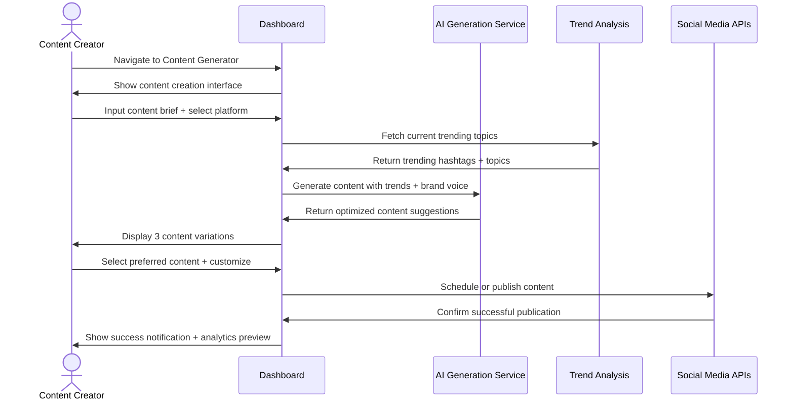
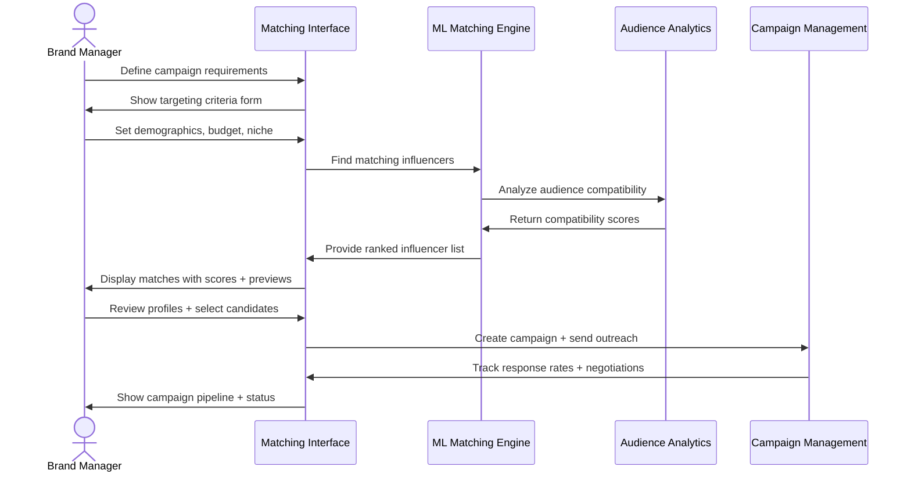
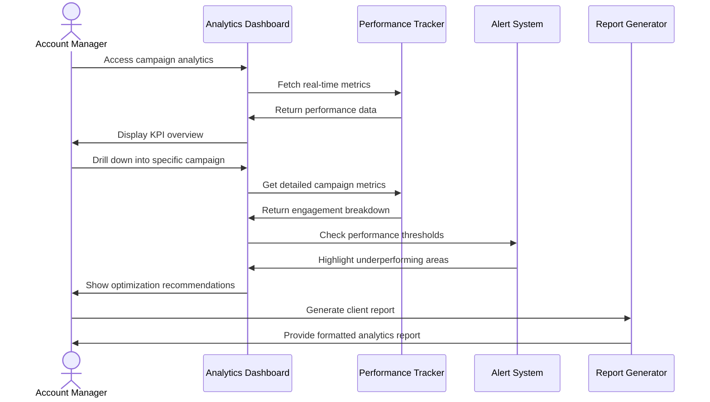
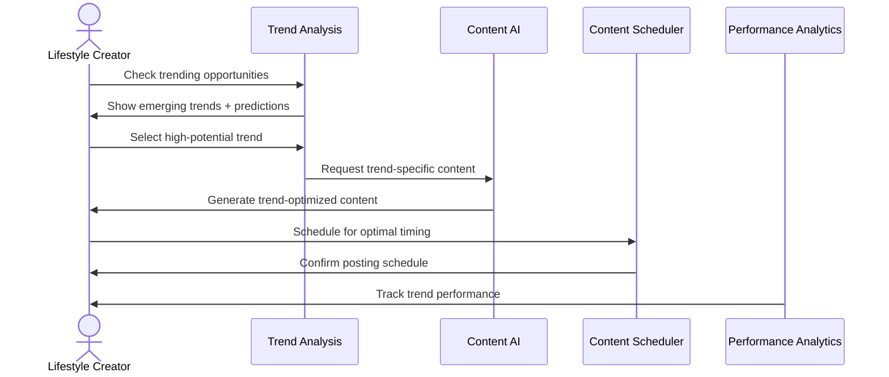
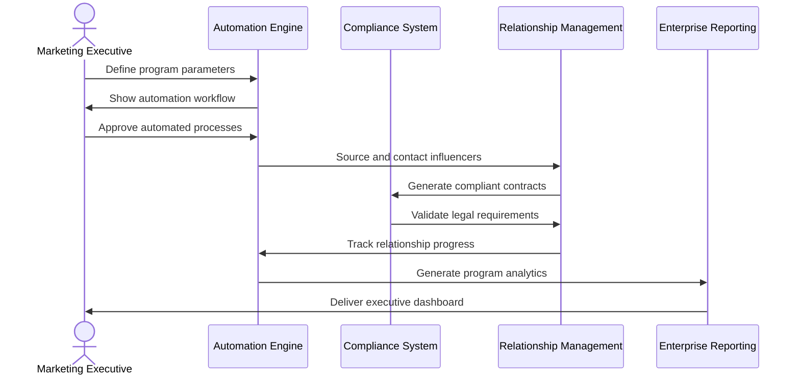

# Jobs-to-be-Done & Use Cases - Must Be Viral V2

## User Persona Definitions

### 1. Content Creator (Individual Influencer)
**Profile**: Individual influencers with 10K-1M followers across social platforms
**Pain Points**: Time-consuming content creation, staying on top of trends, monetizing audience
**Goals**: Grow follower base, increase engagement, generate consistent revenue

### 2. Brand Marketer (Marketing Professional)
**Profile**: Marketing professionals at companies looking for influencer partnerships
**Pain Points**: Finding authentic influencers, measuring ROI, managing campaigns
**Goals**: Increase brand awareness, drive sales, build authentic connections

### 3. Agency Professional (Marketing Agency)
**Profile**: Marketing agencies managing multiple client influencer campaigns
**Pain Points**: Scalable campaign management, client reporting, talent discovery
**Goals**: Deliver measurable results, streamline operations, retain clients

### 4. Enterprise Marketing Team (Large Corporation)
**Profile**: Marketing teams at Fortune 500 companies with complex needs
**Pain Points**: Compliance requirements, global campaigns, performance attribution
**Goals**: Scale marketing efforts, ensure compliance, maximize marketing ROI

## Core Jobs-to-be-Done

### Job 1: "When I need to create engaging content, I want to generate viral-worthy posts quickly so that I can maintain consistent posting without sacrificing quality."

#### User Story: Content Creator Daily Workflow
**As a** content creator with 250K Instagram followers
**I want to** generate 5 posts per day across different themes
**So that** I can maintain audience engagement while saving 4+ hours of brainstorming time

#### Acceptance Criteria
- ✅ Generate text content in under 30 seconds
- ✅ Content adapts to platform-specific best practices
- ✅ Incorporates current trending topics automatically
- ✅ Maintains consistent brand voice across posts
- ✅ Suggests optimal posting times based on audience analytics

#### Happy Path Flow

#### Alternative Flows
- **Content Rejected**: AI suggests improvements based on platform guidelines
- **Trending Topics Unavailable**: System uses historical trend data as fallback
- **Social Media API Down**: Content saved as draft for later publishing

---

### Job 2: "When I'm planning a campaign, I want to find the perfect influencer match so that my brand message reaches the right audience authentically."

#### User Story: Brand Campaign Launch
**As a** marketing manager for a sustainable fashion brand
**I want to** find eco-conscious influencers with engaged audiences aged 18-35
**So that** I can launch an authentic campaign that drives 20% increase in brand awareness

#### Acceptance Criteria
- ✅ Filter influencers by niche, audience demographics, engagement rate
- ✅ Analyze audience overlap with target customer segments
- ✅ Provide authenticity scores based on content history
- ✅ Estimate campaign reach and predicted ROI
- ✅ Streamline outreach and negotiation process

#### Happy Path Flow

#### Alternative Flows
- **No Suitable Matches**: Suggest broadening criteria or waiting for new creators
- **High Competition**: Recommend alternative timing or increased budget
- **Influencer Unavailable**: Suggest similar alternatives from waitlist

---

### Job 3: "When my campaign is live, I want to track performance in real-time so that I can optimize quickly and demonstrate ROI to stakeholders."

#### User Story: Campaign Performance Monitoring
**As an** agency account manager running 15 concurrent campaigns
**I want to** monitor all campaign KPIs in a unified dashboard
**So that** I can identify underperforming campaigns early and optimize before budget is wasted

#### Acceptance Criteria
- ✅ Real-time metrics for reach, engagement, conversions
- ✅ Automated alerts for performance anomalies
- ✅ Comparative analysis against benchmarks
- ✅ Exportable reports for client presentations
- ✅ ROI calculation with attribution modeling

#### Happy Path Flow

---

### Job 4: "When I want to maximize my content's viral potential, I need to understand and leverage current trends so that my posts get maximum organic reach."

#### User Story: Trend-Driven Content Strategy
**As a** TikTok creator specializing in lifestyle content
**I want to** identify emerging trends 24-48 hours before they peak
**So that** I can create content that rides the trend wave and gets featured on the For You page

#### Acceptance Criteria
- ✅ Predictive trend analysis with confidence scores
- ✅ Platform-specific trend recommendations
- ✅ Content templates for trending formats
- ✅ Optimal timing recommendations for trend participation
- ✅ Competitor trend analysis and gap identification

#### Happy Path Flow

---

### Job 5: "When I need to scale my influencer program, I want to automate repetitive tasks so that I can focus on strategy and relationship building."

#### User Story: Enterprise Influencer Program Management
**As a** head of influencer marketing at a Fortune 500 company
**I want to** automate influencer discovery, outreach, and reporting
**So that** I can manage 500+ influencer relationships while maintaining quality and compliance

#### Acceptance Criteria
- ✅ Automated influencer sourcing based on criteria
- ✅ Template-based outreach with personalization
- ✅ Automated contract generation and e-signature
- ✅ Compliance monitoring for disclosure requirements
- ✅ Bulk reporting across all campaigns and regions

#### Happy Path Flow

## Cross-Functional Use Cases

### Use Case: Multi-Platform Campaign Coordination
**Scenario**: Fashion brand launching new collection across Instagram, TikTok, and YouTube
**Complexity**: 50 influencers, 3 platforms, 6-week campaign, 12 markets
**Success Metrics**: 10M impressions, 2% engagement rate, 500K website visits

**Workflow Integration**:
1. **Campaign Planning** → Multi-platform strategy with platform-specific content
2. **Influencer Matching** → Diversified creator portfolio across platforms
3. **Content Generation** → Platform-optimized content variations
4. **Performance Tracking** → Unified analytics across all platforms
5. **Optimization** → Real-time budget reallocation based on performance

### Use Case: Crisis Management & Brand Safety
**Scenario**: Influencer posts controversial content during active campaign
**Trigger**: Automated brand safety monitoring detects risk
**Response Time**: <30 minutes for initial response, <2 hours for resolution

**Crisis Response Flow**:
1. **Detection** → AI monitoring flags problematic content
2. **Assessment** → Risk scoring and impact analysis
3. **Notification** → Immediate alerts to brand team
4. **Response** → Automated campaign pause + manual review
5. **Resolution** → Content removal or campaign termination
6. **Learning** → Update screening criteria and monitoring rules

### Use Case: Global Campaign Localization
**Scenario**: Technology company launching product in 15 countries
**Challenges**: Cultural adaptation, local regulations, timezone coordination
**Outcome**: Culturally relevant campaigns with 95% compliance rate

**Localization Workflow**:
1. **Global Strategy** → Master campaign template and guidelines
2. **Local Adaptation** → Region-specific influencer criteria and content
3. **Cultural Review** → Local team validation of content and partnerships
4. **Compliance Check** → Automated legal and regulatory verification
5. **Coordinated Launch** → Synchronized timing across timezones
6. **Performance Comparison** → Cross-regional analytics and optimization

## Success Metrics & KPIs

### Content Creator Success Metrics
- **Content Creation Speed**: 5x faster than manual creation
- **Engagement Rate**: 25% higher than platform average
- **Follower Growth**: 15% monthly growth rate
- **Revenue Increase**: 40% increase in brand partnership income

### Brand Marketer Success Metrics
- **Campaign Setup Time**: 75% reduction in planning time
- **Influencer Match Quality**: 90% satisfaction with matched creators
- **Campaign ROI**: 3.2x return on advertising spend
- **Brand Awareness Lift**: 35% increase in brand recognition

### Platform-Wide Success Metrics
- **User Engagement**: 45% of users active daily
- **Content Generation Volume**: 50K+ pieces generated monthly
- **Campaign Success Rate**: 85% of campaigns meet or exceed KPIs
- **Time-to-Value**: Users see results within first week

---

*Use cases validated through user research and beta testing*
*Success metrics based on industry benchmarks and pilot program results*
*Workflow diagrams represent production system behavior*