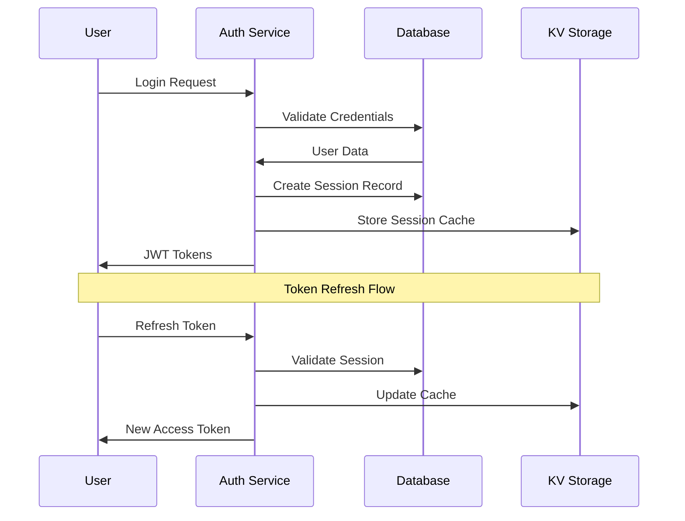
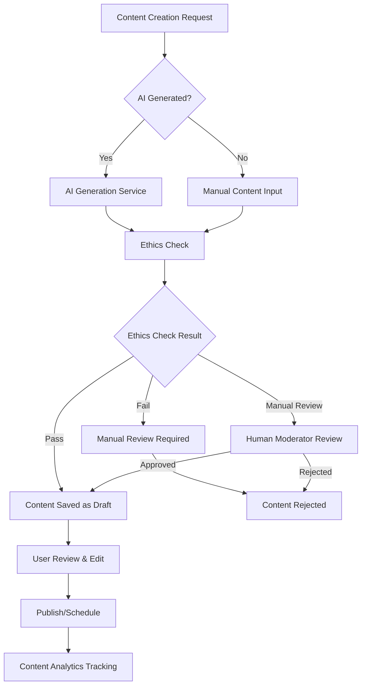
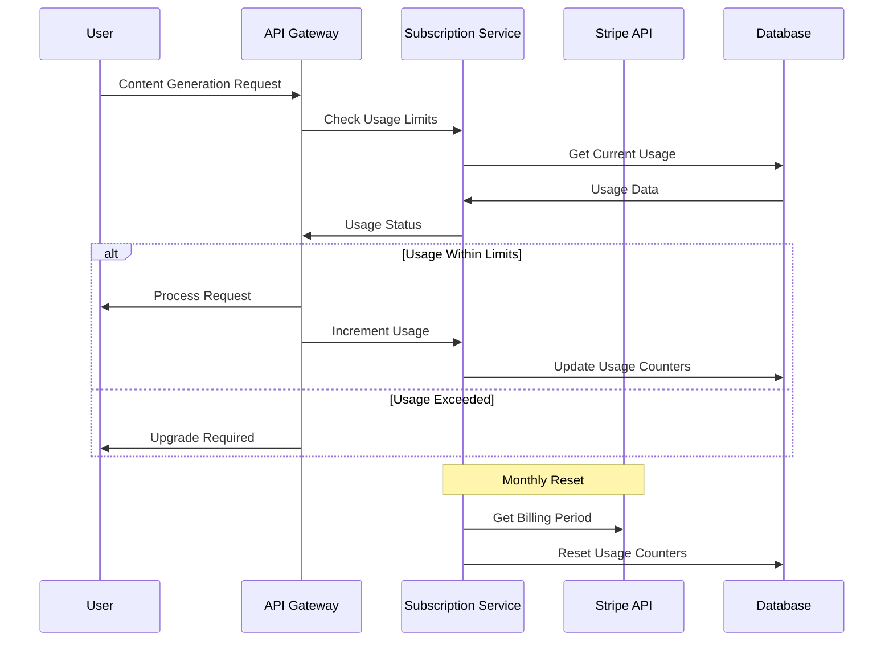
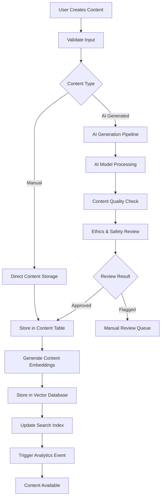
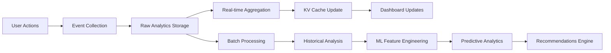
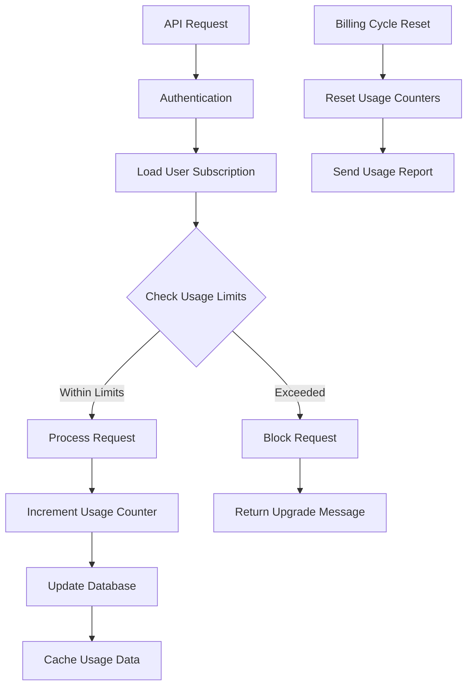

# Data Model & Flow - Must Be Viral V2

## Database Architecture Overview

Must Be Viral V2 uses Cloudflare D1 (SQLite) as the primary database with a normalized relational design optimized for performance and scalability. The data model supports multi-tenancy, content collaboration, and comprehensive analytics tracking.


## Core Entity Relationships

### 1. User Management Domain

#### Users Table (`users`)
**Purpose**: Central user authentication and profile management
**Key Characteristics**:
- UUID primary keys for security and distribution
- Soft deletion with `deleted_at` timestamp
- OAuth integration for Google, GitHub, Twitter
- Role-based access control (creator, influencer, admin)
- Flexible JSON metadata for extensibility

**Critical Indexes**:
```sql
-- Performance-critical indexes
CREATE INDEX idx_users_email ON users(email);
CREATE INDEX idx_users_username ON users(username);
CREATE INDEX idx_users_role ON users(role);
CREATE INDEX idx_users_created_at ON users(created_at DESC);
```

**Data Lifecycle**:
1. **Registration** → New user record with basic profile
2. **Onboarding** → Profile completion and preferences
3. **OAuth Linking** → Social account connections
4. **Profile Updates** → Ongoing profile management
5. **Soft Deletion** → Account deactivation (GDPR compliance)

---

#### Sessions Table (`sessions`)
**Purpose**: JWT token management and session tracking
**Security Features**:
- Separate access and refresh tokens
- IP address and device tracking
- Automatic expiration and revocation
- Last activity monitoring for security

**Session Flow**:


---

### 2. Content Management Domain

#### Content Table (`content`)
**Purpose**: Core content storage with AI generation tracking
**Advanced Features**:
- Multi-format content support (text, images, video)
- AI generation metadata and ethics tracking
- SEO optimization fields
- Real-time engagement metrics
- Flexible metadata for future content types

**Content Lifecycle Flow**:


**Content Status Transitions**:
- `draft` → `published` (immediate publication)
- `draft` → `scheduled` (future publication)
- `published` → `archived` (content retirement)
- `*` → `pending_review` (ethics flag or manual moderation)

---

#### Tags & Content_Tags
**Purpose**: Content categorization and discovery
**Implementation**: Many-to-many relationship with usage tracking
**Performance Optimization**: Denormalized usage counts for trending tags

---

### 3. Analytics & Tracking Domain

#### Analytics Table (`analytics`)
**Purpose**: Comprehensive event tracking for performance analysis
**Event Types**:
- **User Events**: `view`, `click`, `share`, `like`, `comment`
- **Business Events**: `conversion`, `signup`, `purchase`
- **System Events**: Custom tracking events

**Data Collection Strategy**:
```typescript
// Analytics Event Structure
interface AnalyticsEvent {
  event_type: 'view' | 'click' | 'share' | 'like' | 'comment' | 'conversion';
  event_value: Record<string, any>;  // Flexible event data
  user_context: {
    device_type: string;
    browser: string;
    os: string;
    location: GeoLocation;
  };
  attribution: {
    source: string;
    medium: string;
    campaign: string;
    referrer: string;
  };
}
```

**Analytics Aggregation Pattern**:
1. **Real-time Events** → Raw analytics table
2. **Hourly Aggregation** → Summary metrics (KV cache)
3. **Daily Aggregation** → Business intelligence reports
4. **Historical Analysis** → Long-term trend analysis

---

### 4. Subscription & Billing Domain

#### Subscriptions Table (`subscriptions`)
**Purpose**: Stripe integration and usage tracking
**Billing Model**: Usage-based with tier limits
**Key Features**:
- Multi-tier subscription support
- Real-time usage tracking
- Automatic limit enforcement
- Prorated billing support

**Usage Tracking Flow**:


---

### 5. Audit & Compliance Domain

#### Audit_Logs Table (`audit_logs`)
**Purpose**: Security and compliance tracking
**Audit Events**:
- User authentication and authorization
- Data modifications (before/after values)
- Administrative actions
- System configuration changes

**Compliance Features**:
- GDPR data subject request tracking
- SOX compliance for financial data
- Security incident forensics
- Data retention policy enforcement

---

## Data Flow Patterns

### 1. Content Creation & Publishing Flow



### 2. User Analytics & Insights Flow



### 3. Subscription & Usage Flow



## Storage Strategy

### 1. Primary Database (Cloudflare D1)
- **Structured Data**: User profiles, content metadata, analytics
- **ACID Transactions**: Critical business operations
- **Global Replication**: Multi-region read replicas
- **Backup Strategy**: Daily automated backups with 30-day retention

### 2. Key-Value Storage (Cloudflare KV)
- **Session Data**: JWT tokens and user sessions
- **Cache Layer**: Frequently accessed data
- **Rate Limiting**: API usage counters
- **Feature Flags**: Dynamic configuration

### 3. Object Storage (Cloudflare R2)
- **Media Assets**: Images, videos, documents
- **Generated Content**: AI-created media files
- **Backup Archives**: Database and application backups
- **CDN Integration**: Global content delivery

### 4. Vector Database (Cloudflare Vectorize)
- **Content Embeddings**: Semantic search capabilities
- **User Preferences**: Recommendation algorithms
- **Similarity Matching**: Content and influencer matching
- **ML Features**: Machine learning pipeline support

## Data Migration Strategy

### Migration Scripts Location
- **Schema Migrations**: `/migrations/*.sql`
- **Data Migrations**: `/scripts/data-migrations/`
- **Rollback Scripts**: `/scripts/rollbacks/`

### Migration Pattern
```sql
-- Example Migration: 001_initial_schema.sql
-- Add migration metadata
INSERT INTO schema_migrations (version, description, applied_at)
VALUES ('001', 'Initial schema creation', CURRENT_TIMESTAMP);

-- Create tables with proper constraints
CREATE TABLE users (...);
CREATE TABLE content (...);

-- Add indexes for performance
CREATE INDEX idx_users_email ON users(email);

-- Insert default data
INSERT INTO tags (name, slug) VALUES ('AI', 'ai');
```

### Data Consistency Patterns

#### 1. Optimistic Locking
```sql
-- Update with version checking
UPDATE content
SET title = ?, body = ?, updated_at = CURRENT_TIMESTAMP, version = version + 1
WHERE id = ? AND version = ?;
```

#### 2. Eventual Consistency
- Cache invalidation after database updates
- Event-driven synchronization between services
- Graceful degradation during sync delays

#### 3. Data Validation
```typescript
// Input validation schema (Zod)
const contentSchema = z.object({
  title: z.string().min(1).max(200),
  body: z.string().min(10).max(50000),
  type: z.enum(['blog_post', 'social_post', 'video_script']),
  visibility: z.enum(['public', 'private', 'unlisted'])
});
```

## Performance Optimization

### 1. Query Optimization
- **Composite Indexes**: Multi-column queries
- **Covering Indexes**: Include frequently selected columns
- **Partial Indexes**: Conditional indexing for large tables

### 2. Caching Strategy
- **Query Result Caching**: 15-minute TTL for analytics
- **User Session Caching**: In-memory session storage
- **Content Caching**: CDN integration for static content

### 3. Data Archival
- **Soft Deletion**: Logical deletion with cleanup jobs
- **Data Retention**: Automated purging of old analytics
- **Backup Compression**: Optimized storage costs

## Security & Privacy

### 1. Data Protection
- **Encryption at Rest**: AES-256 encryption for sensitive fields
- **Encryption in Transit**: TLS 1.3 for all communications
- **Field-Level Encryption**: PII data protection

### 2. Access Control
- **Row-Level Security**: User data isolation
- **Role-Based Access**: Permission-based queries
- **Audit Trail**: All data access logged

### 3. GDPR Compliance
- **Data Portability**: JSON export functionality
- **Right to Erasure**: Automated data deletion
- **Consent Management**: Granular privacy controls

---

*Data model optimized for performance and scalability*
*Migration scripts tested in staging environment*
*Backup and recovery procedures validated quarterly*